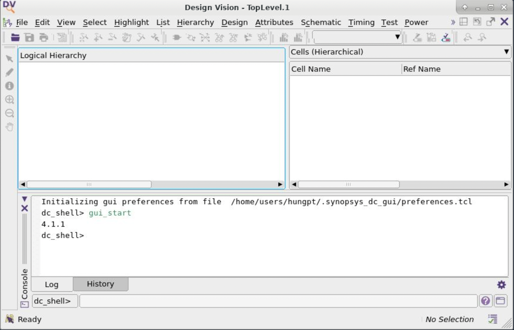
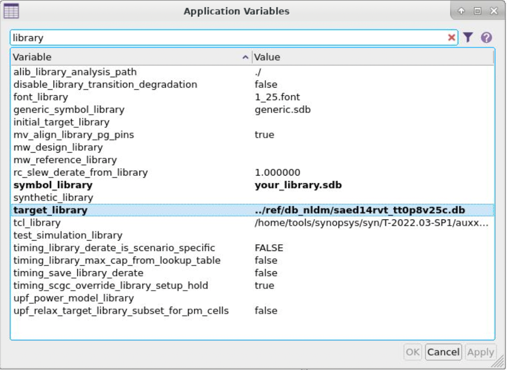
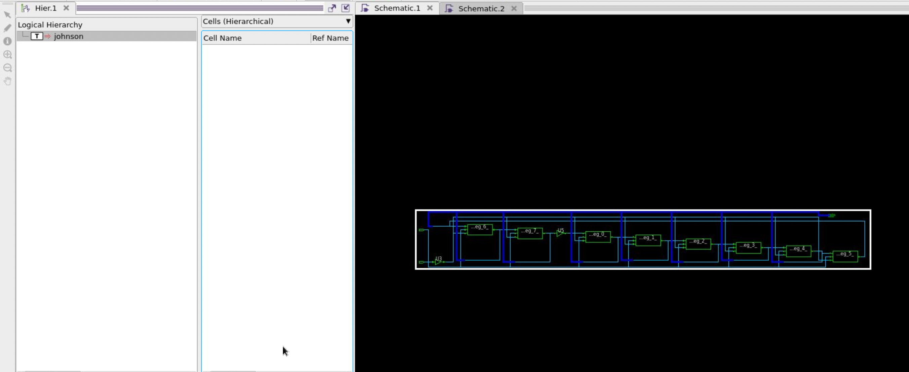

# Lab 1: Logic Synthesis with Design Compiler

### 1. Start Design Compiler graphical user interface (GUI) from the syn directory

### 2. Design Compiler starts it automatically reads “.synopsys_dc.setup”

### 3. Complile the Johnson counter

#### 3.1 Explain the area report

    ****************************************
    Report : area
    Design : johnson
    Version: T-2022.03-SP1
    Date   : Sun Sep 15 10:31:46 2024
    ****************************************

    Information: Updating design information... (UID-85)
    Library(s) Used:

        saed14rvt_tt0p8v25c (File: /home/users/hungpt/icdesign/session1/m3/lab01/ref/db_nldm/saed14rvt_tt0p8v25c.db)

- Lists the library used for synthesis: saed14rvt_tt0p8v25c, this is a 14nm process library with regular Vt (threshold voltage) cells, typical-typical corner, 0.8V supply, 25°C

Next part:

    Number of ports:                           10
    Number of nets:                            12
    Number of cells:                           10
    Number of combinational cells:              2
    Number of sequential cells:                 8
    Number of macros/black boxes:               0
    Number of buf/inv:                          2
    Number of references:                       3

- Provides a summary of the design's components:
  - 10 ports: Total I/O ports in the design
  - 12 nets: Total number of connections
  - 10 cells: Total number of logic cells
  - 2 combinational cells: Cells like AND, OR gates
  - 8 sequential cells: Likely flip-flops for the 8-bit Johnson counter
  - 0 macros/black boxes: No complex predefined blocks
  - 2 buf/inv: Number of buffers or inverters
  - 3 references: Unique cell types used

Next part:

    Combinational area:                  0.355200
    Buf/Inv area:                        0.355200
    Noncombinational area:               8.524800
    Macro/Black Box area:                0.000000
    Net Interconnect area:               3.550286

Breaks down the area usage by cell type: - Combinational area: Logic gates (0.3552 units) - Buf/Inv area: Buffers and inverters (0.3552 units, same as combinational, suggesting all combinational cells are buf/inv) - Noncombinational area: Sequential elements (8.5248 units) - Macro/Black Box area: None used - Net Interconnect area: Estimated wiring area (3.550286 units)

Next part:

    Total cell area:                     8.880000
    Total area:                         12.430287

- Summarizes the total area:
  - Total cell area: Sum of all cells (8.88 units)
  - Total area: Includes cells and interconnect (12.430287 units)

Next part:

    Hierarchical area distribution
    ------------------------------

                                    Global cell area          Local cell area
                                    ------------------  ---------------------------
    Hierarchical cell                 Absolute   Percent  Combi-    Noncombi-  Black-
                                    Total      Total    national  national   boxes   Design
    --------------------------------  ---------  -------  --------  ---------  ------  ---------
    johnson                              8.8800    100.0    0.3552     8.5248  0.0000  johnson
    --------------------------------  ---------  -------  --------  ---------  ------  ---------
    Total                                                   0.3552     8.5248  0.0000

- Provides a hierarchical breakdown of area usage:
  - In this case, there's only one level (johnson)
  - Shows global and local cell areas
  - Confirms earlier area breakdowns:
  - 0.3552 units for combinational logic
  - 8.5248 units for noncombinational (sequential) logic
  - No black boxes
  - Total matches the earlier reported cell area of 8.88 units

#### 3.2 Explain the timing constrains report

    ****************************************
    Report : constraint
    Design : johnson
    Version: T-2022.03-SP1
    Date   : Sun Sep 15 10:31:46 2024
    ****************************************

                                                    Weighted
        Group (max_delay/setup)      Cost     Weight     Cost
        -----------------------------------------------------
        clk                          0.00      1.00      0.00
        default                      0.00      1.00      0.00
        -----------------------------------------------------
        max_delay/setup                                  0.00

- Reports on hold timing constraints:
  - 'clk' group has no hold fixing applied
  - Both 'clk' and 'default' groups have 0.00 cost
  - Weighted cost is 0.00, indicating all hold constraints are met

Next part:

                              Total Neg  Critical
    Group (critical_range)      Slack    Endpoints   Cost
    -----------------------------------------------------
    clk                          0.00         0      0.00
    default                      0.00         0      0.00
    -----------------------------------------------------
    critical_range                                   0.00

- Reports on critical range constraints:
  - Both 'clk' and 'default' groups have 0.00 total negative slack
  - No critical endpoints
  - Cost is 0.00, indicating no violations

Next part:

                                                   Weighted
    Group (min_delay/hold)       Cost     Weight     Cost
    -----------------------------------------------------
    clk (no fix_hold)            0.00      1.00      0.00
    default                      0.00      1.00      0.00
    -----------------------------------------------------
    min_delay/hold                                   0.00

- Reports on hold timing constraints:
  - 'clk' group has no hold fixing applied
  - Both 'clk' and 'default' groups have 0.00 cost
  - Weighted cost is 0.00, indicating all hold constraints are met

Next part:

    Constraint                                       Cost
    -----------------------------------------------------
    min_capacitance                                  0.00 (MET)
    max_capacitance                                  0.00 (MET)
    max_delay/setup                                  0.00 (MET)
    sequential_clock_pulse_width                     0.00 (MET)
    critical_range                                   0.00 (MET)

- Summary of various design constraints:
  - min_capacitance: Minimum load capacitance constraints are met
  - max_capacitance: Maximum load capacitance constraints are met
  - max_delay/setup: Maximum delay and setup time constraints are met
  - sequential_clock_pulse_width: Clock pulse width constraints for sequential elements are met
  - critical_range: Critical range constraints are met

#### 3.3 Explain the Quality of Results (QoR) report

Next part:

    Timing Path Group 'clk'
    -----------------------------------
    Levels of Logic:               0.00
    Critical Path Length:          0.04
    Critical Path Slack:           0.46
    Critical Path Clk Period:      2.00
    Total Negative Slack:          0.00
    No. of Violating Paths:        0.00
    Worst Hold Violation:         -0.27
    Total Hold Violation:         -2.12
    No. of Hold Violations:        8.00
    -----------------------------------

- This section provides timing information for the 'clk' path group:
  - Levels of Logic: 0.00 (unusual, might indicate a direct path or reporting issue)
  - Critical Path Length: 0.04 ns (longest path delay)
  - Critical Path Slack: 0.46 ns (margin on the critical path)
  - Critical Path Clk Period: 2.00 ns (clock period constraint)
  - Total Negative Slack: 0.00 (sum of setup violations, none here)
  - No. of Violating Paths: 0.00 (no setup timing violations)
  - Worst Hold Violation: -0.27 ns (most severe hold time violation)
  - Total Hold Violation: -2.12 ns (sum of all hold violations)
  - No. of Hold Violations: 8.00 (number of paths with hold time issues)

Next part:

    Cell Count
    -----------------------------------
    Hierarchical Cell Count:          0
    Hierarchical Port Count:          0
    Leaf Cell Count:                 10
    Buf/Inv Cell Count:               2
    Buf Cell Count:                   0
    Inv Cell Count:                   2
    CT Buf/Inv Cell Count:            0
    Combinational Cell Count:         2
    Sequential Cell Count:            8
    Macro Count:                      0
    -----------------------------------

- This section provides a breakdown of the cells in the design:
  - No hierarchical cells or ports (flat design)
  - 10 leaf cells total
  - 2 buffer/inverter cells, all inverters
  - 2 combinational cells (likely the inverters)
  - 8 sequential cells (matches the 8-bit Johnson counter)
  - No macro cells used

Next part:

    Area
    -----------------------------------
    Combinational Area:        0.355200
    Noncombinational Area:     8.524800
    Buf/Inv Area:              0.355200
    Total Buffer Area:             0.00
    Total Inverter Area:           0.36
    Macro/Black Box Area:      0.000000
    Net Area:                  3.550286
    -----------------------------------
    Cell Area:                 8.880000
    Design Area:              12.430287

- This section breaks down the area usage:
  - Combinational Area: 0.3552 (matches Buf/Inv Area)
  - Noncombinational Area: 8.5248 (likely the 8 flip-flops)
  - Total Inverter Area: 0.36 (slightly rounded from 0.3552)
  - Net Area: 3.550286 (interconnect area)
  - Cell Area: 8.88 (total of combinational and noncombinational)
  - Design Area: 12.430287 (total including nets)

Next part:

    Design Rules
    -----------------------------------
    Total Number of Nets:            12
    Nets With Violations:             0
    Max Trans Violations:             0
    Max Cap Violations:               0
    -----------------------------------

- This section shows compliance with design rules:
  - 12 total nets
  - No violations for transitions or capacitance

Next part:

    Compile CPU Statistics
    -----------------------------------------
    Resource Sharing:                    0.00
    Logic Optimization:                  3.77
    Mapping Optimization:                0.04
    -----------------------------------------
    Overall Compile Time:               11.66
    Overall Compile Wall Clock Time:    13.21

- This section provides compilation statistics:
  - Hostname where synthesis was run
  - CPU time for different optimization stages
  - Total compile time: 11.66 CPU seconds, 13.21 wall clock seconds

Next part:

    --------------------------------------------------------------------

    Design  WNS: 0.00  TNS: 0.00  Number of Violating Paths: 0

    Design (Hold)  WNS: 0.27  TNS: 2.12  Number of Violating Paths: 8

    --------------------------------------------------------------------

- Final summary of timing results:
  - WNS: Worst Negative Slack (0.00 for setup, 0.27 for hold)
  - TNS: Total Negative Slack (0.00 for setup, 2.12 for hold)
  - Confirms 8 hold time violating paths

#### 3.4 Explain the timing report

    ****************************************
    Report : timing
            -path full
            -delay max
            -max_paths 1
    Design : johnson
    Version: T-2022.03-SP1
    Date   : Sun Sep 15 10:31:46 2024
    ****************************************

    Operating Conditions: tt0p8v25c   Library: saed14rvt_tt0p8v25c
    Wire Load Model Mode: top

      Startpoint: out_reg[7] (rising edge-triggered flip-flop clocked by clk)
      Endpoint: out[7] (output port clocked by clk)
      Path Group: clk
      Path Type: max

      Des/Clust/Port     Wire Load Model       Library
      ------------------------------------------------
      johnson            ForQA                 saed14rvt_tt0p8v25c

Next part:

    Point                                                   Incr       Path
    --------------------------------------------------------------------------
    clock clk (rise edge)                                   0.00       0.00
    clock network delay (ideal)                             0.00       0.00
    out_reg[7]/CK (SAEDRVT14_FDPRBQ_V2_0P5)                 0.00       0.00 r
    out_reg[7]/Q (SAEDRVT14_FDPRBQ_V2_0P5)                  0.04       0.04 r
    out[7] (out)                                            0.00       0.04 r
    data arrival time                                                  0.04

- Detailed timing path:
  - Clock rises at 0.00
  - No clock network delay (ideal clock)
  - Signal propagates through out_reg[7] flip-flop
  - Q output of flip-flop changes after 0.04ns
  - Reaches out[7] port immediately (0.00 incr)
  - Total data arrival time: 0.04ns

Next part:

    clock clk (rise edge)                                   2.00       2.00
    clock network delay (ideal)                             0.00       2.00
    clock uncertainty                                      -0.30       1.70
    output external delay                                  -1.20       0.50
    data required time                                                 0.50
    --------------------------------------------------------------------------
    data required time                                                 0.50
    data arrival time                                                 -0.04
    --------------------------------------------------------------------------
    slack (MET)                                                        0.46

- Required time calculation:
  - Clock period is 2.00ns
  - Clock uncertainty of 0.30ns is subtracted
  - Output external delay of 1.20ns is subtracted
  - Results in required time of 0.50ns
  - Slack calculation:
  - Required time (0.50) - Arrival time (0.04) = 0.46ns slack
  - Positive slack means timing is met

### 4. Timing violations

Trong mục [3.3 Qor report](#33-explain-the-quality-of-results-qor-report) có tám Hold time violations. Điều này xảy ra bởi data đã thay đổi trước khi Hold time kết thúc. Trong file `.sdc` chúng ta đã đặt `set_clock_uncertainty 0.3` đây là một số khá lớn. Có thể điều chỉnh xuống `0.1`.

Sau khi điều chỉnh `clock uncertainty`, Hold time violations đã biến mất.
Sau đây là các file report mới.

#### 4.1 New area report

    ****************************************
    Report : area
    Design : johnson
    Version: T-2022.03-SP1
    Date   : Sun Sep 15 14:20:15 2024
    ****************************************

    Information: Updating design information... (UID-85)
    Library(s) Used:

        saed14rvt_tt0p8v25c (File: /home/users/hungpt/icdesign/session1/m3/lab01/ref/db_nldm/saed14rvt_tt0p8v25c.db)

    Number of ports:                           10
    Number of nets:                            12
    Number of cells:                           10
    Number of combinational cells:              2
    Number of sequential cells:                 8
    Number of macros/black boxes:               0
    Number of buf/inv:                          2
    Number of references:                       3

    Combinational area:                  0.355200
    Buf/Inv area:                        0.355200
    Noncombinational area:               8.524800
    Macro/Black Box area:                0.000000
    Net Interconnect area:               3.550286

    Total cell area:                     8.880000
    Total area:                         12.430287

    Hierarchical area distribution
    ------------------------------

                                      Global cell area          Local cell area
                                      ------------------  ---------------------------
    Hierarchical cell                 Absolute   Percent  Combi-    Noncombi-  Black-
                                      Total      Total    national  national   boxes   Design
    --------------------------------  ---------  -------  --------  ---------  ------  ---------
    johnson                              8.8800    100.0    0.3552     8.5248  0.0000  johnson
    --------------------------------  ---------  -------  --------  ---------  ------  ---------
    Total                                                   0.3552     8.5248  0.0000

#### 4.2 New timing constrains report

    ****************************************
    Report : constraint
    Design : johnson
    Version: T-2022.03-SP1
    Date   : Sun Sep 15 14:20:15 2024
    ****************************************

                                                      Weighted
        Group (max_delay/setup)      Cost     Weight     Cost
        -----------------------------------------------------
        clk                          0.00      1.00      0.00
        default                      0.00      1.00      0.00
        -----------------------------------------------------
        max_delay/setup                                  0.00

                                  Total Neg  Critical
        Group (critical_range)      Slack    Endpoints   Cost
        -----------------------------------------------------
        clk                          0.00         0      0.00
        default                      0.00         0      0.00
        -----------------------------------------------------
        critical_range                                   0.00

                                                      Weighted
        Group (min_delay/hold)       Cost     Weight     Cost
        -----------------------------------------------------
        clk (no fix_hold)            0.00      1.00      0.00
        default                      0.00      1.00      0.00
        -----------------------------------------------------
        min_delay/hold                                   0.00

        Constraint                                       Cost
        -----------------------------------------------------
        min_capacitance                                  0.00 (MET)
        max_capacitance                                  0.00 (MET)
        max_delay/setup                                  0.00 (MET)
        sequential_clock_pulse_width                     0.00 (MET)
        critical_range                                   0.00 (MET)

#### 4.3 New Quality of Results (QoR) report

    ****************************************
    Report : qor
    Design : johnson
    Version: T-2022.03-SP1
    Date   : Sun Sep 15 14:20:15 2024
    ****************************************

      Timing Path Group 'clk'
      -----------------------------------
      Levels of Logic:               0.00
      Critical Path Length:          0.04
      Critical Path Slack:           0.66
      Critical Path Clk Period:      2.00
      Total Negative Slack:          0.00
      No. of Violating Paths:        0.00
      Worst Hold Violation:         -0.07
      Total Hold Violation:         -0.52
      No. of Hold Violations:        8.00
      -----------------------------------

      Cell Count
      -----------------------------------
      Hierarchical Cell Count:          0
      Hierarchical Port Count:          0
      Leaf Cell Count:                 10
      Buf/Inv Cell Count:               2
      Buf Cell Count:                   0
      Inv Cell Count:                   2
      CT Buf/Inv Cell Count:            0
      Combinational Cell Count:         2
      Sequential Cell Count:            8
      Macro Count:                      0
      -----------------------------------

      Area
      -----------------------------------
      Combinational Area:        0.355200
      Noncombinational Area:     8.524800
      Buf/Inv Area:              0.355200
      Total Buffer Area:             0.00
      Total Inverter Area:           0.36
      Macro/Black Box Area:      0.000000
      Net Area:                  3.550286
      -----------------------------------
      Cell Area:                 8.880000
      Design Area:              12.430287

      Design Rules
      -----------------------------------
      Total Number of Nets:            12
      Nets With Violations:             0
      Max Trans Violations:             0
      Max Cap Violations:               0
      -----------------------------------

      Hostname: vku-truongsa

      Compile CPU Statistics
      -----------------------------------------
      Resource Sharing:                    0.00
      Logic Optimization:                  0.74
      Mapping Optimization:                0.04
      -----------------------------------------
      Overall Compile Time:                6.11
      Overall Compile Wall Clock Time:     6.81

      --------------------------------------------------------------------

      Design  WNS: 0.00  TNS: 0.00  Number of Violating Paths: 0

      Design (Hold)  WNS: 0.07  TNS: 0.52  Number of Violating Paths: 8

      --------------------------------------------------------------------

    1

#### 4.4 New timing report

    ****************************************
    Report : timing
            -path full
            -delay max
            -max_paths 1
    Design : johnson
    Version: T-2022.03-SP1
    Date   : Sun Sep 15 14:20:15 2024
    ****************************************

    Operating Conditions: tt0p8v25c   Library: saed14rvt_tt0p8v25c
    Wire Load Model Mode: top

      Startpoint: out_reg[7] (rising edge-triggered flip-flop clocked by clk)
      Endpoint: out[7] (output port clocked by clk)
      Path Group: clk
      Path Type: max

      Des/Clust/Port     Wire Load Model       Library
      ------------------------------------------------
      johnson            ForQA                 saed14rvt_tt0p8v25c

      Point                                                   Incr       Path
      --------------------------------------------------------------------------
      clock clk (rise edge)                                   0.00       0.00
      clock network delay (ideal)                             0.00       0.00
      out_reg[7]/CK (SAEDRVT14_FDPRBQ_V2_0P5)                 0.00       0.00 r
      out_reg[7]/Q (SAEDRVT14_FDPRBQ_V2_0P5)                  0.04       0.04 r
      out[7] (out)                                            0.00       0.04 r
      data arrival time                                                  0.04

      clock clk (rise edge)                                   2.00       2.00
      clock network delay (ideal)                             0.00       2.00
      clock uncertainty                                      -0.10       1.90
      output external delay                                  -1.20       0.70
      data required time                                                 0.70
      --------------------------------------------------------------------------
      data required time                                                 0.70
      data arrival time                                                 -0.04
      --------------------------------------------------------------------------
      slack (MET)                                                        0.66

    1
