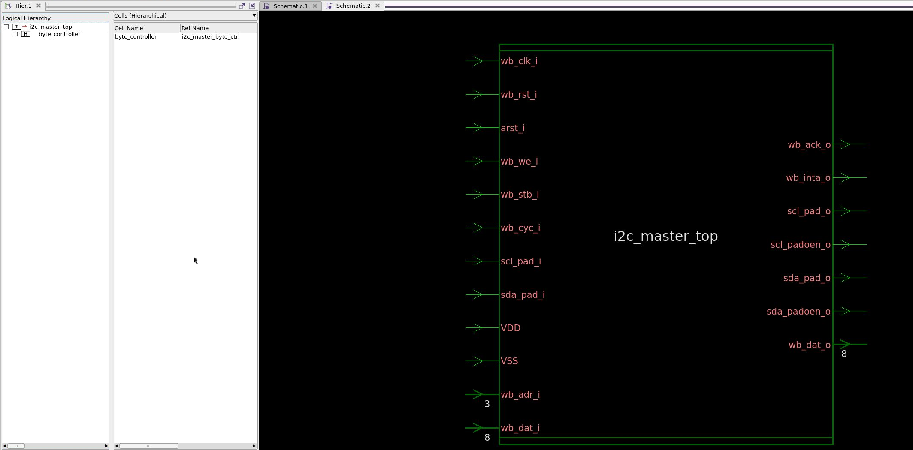
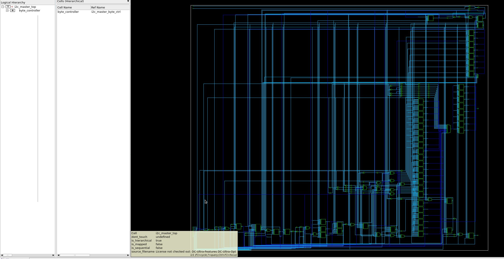

# Logic Synthesis & timing constraints

### 1. Move to the working directory lab02/syn

```sh
cd $HOME/icdesign/m3/lab02/syn
```

### 2. Simulate the design

The simulation command:

    vcs -debug_access+all +nospecify \
    +incdir+../src/tb \
    +incdir+../src/rtl/verilog \
    ../src/rtl/verilog/i2c_master_bit_ctrl.v \
    ../src/rtl/verilog/i2c_master_byte_ctrl.v \
    ../src/rtl/verilog/i2c_master_top.v \
    ../src/tb/i2c_slave_model.v \
    ../src/tb/wb_master_model.v \
    ../src/tb/tst_bench_top.v
    ./simv -nc

The simulation result:

    status:                  500 done reset
    status:                10600 programmed registers
    status:                14600 verified registers
    status:                17600 core enabled
    status:                22600 generate 'start', write cmd 20 (slave address+write)
    status:             10881600 tip==0
    status:             10886600 write slave memory address 01
    status:             20521600 tip==0
    status:             20526600 write data a5
    status:             39595600 tip==0
    status:             39600600 write next data 5a, generate 'stop'
    status:             50304600 tip==0
    status:             50309600 generate 'start', write cmd 20 (slave address+write)
    status:             61169600 tip==0
    status:             61174600 write slave address 01
    status:             70807600 tip==0
    status:             70812600 generate 'repeated start', write cmd 21 (slave address+read)
    status:             81720600 tip==0
    status:             81723600 read + ack
    status:             91359600 tip==0
    status:             91362600 received a5
    status:             91365600 read + ack
    status:            100998600 tip==0
    status:            101001600 received 5a
    status:            101004600 read + ack
    status:            110637600 tip==0
    status:            110640600 received xx from 3rd read address
    status:            110643600 read + nack
    status:            120276600 tip==0
    status:            120279600 received xx from 4th read address
    status:            120284600 generate 'start', write cmd 20 (slave address+write). Check invalid address
    status:            131192600 tip==0
    status:            131197600 write slave memory address 10
    status:            140830600 tip==0
    status:            140830600 Check for nack
    status:            140833600 generate 'stop'
    status:            140836600 tip==0


    status:            165836600 Testbench done

### 3. Invoke Design Compiler

```sh
source /home/tools/synopsys/env.sh
dc_shell -gui
```

### 4. Setup target and link libraries.

1.  Quest 1:

    Take a look at /home/dkits/synopsys/SAED14nm/stdcell_rvt/db_nldm by running this command:

    ```sh
    ls -al /home/dkits/synopsys/SAED14nm/stdcell_rvt/db_nldm
    ```

    How many operating corners are provided in this technology?

    **The answer is:** there are about 18 operating corners provided in this technology.

2.  Quest 2:

    Open `/home/dkits/synopsys/SAED14nm/stdcell_rvt/db_nldm/saed14rvt_tt0p8v25c.lib` using a text editor.

    What is the area of the 2-input NAND with drive strength of 1 in this standard cell libraries?

    **The answer is:** 0.3108 um2

    What is the operating voltage, temperature and the process corner?

    **The answer is:** The operating voltage 0.8v, temperature 25C, and the process is typical-typical.

    Setup the target library commands:

        set search_path ". /home/dkits/synopsys/SAED14nm/stdcell_rvt/db_nldm ../src/rtl/verilog"
        set link_library          "* saed14rvt_tt0p8v25c.db"
        set target_library        "saed14rvt_tt0p8v25c.db"
        set_min_library saed14rvt_ss0p6v125c.db -min_version saed14rvt_ff0p88vm40c.db

    Here is the command log.

        dc_shell> 4.1.1
        set search_path ". /home/dkits/synopsys/SAED14nm/stdcell_rvt/db_nldm ../src/rtl/verilog"
        . /home/dkits/synopsys/SAED14nm/stdcell_rvt/db_nldm ../src/rtl/verilog
        dc_shell> set link_library "_ saed14rvt_tt0p8v25c.db"
        _ saed14rvt_tt0p8v25c.db
        dc_shell> set target_library "saed14rvt_tt0p8v25c.db"
        saed14rvt_tt0p8v25c.db
        dc_shell> set_min_library saed14rvt_ss0p6v125c.db -min_version saed14rvt_ff0p88vm40c.db
        Loading db file '/home/dkits/synopsys/SAED14nm/stdcell_rvt/db_nldm/saed14rvt_ss0p6v125c.db'
        Loading db file '/home/dkits/synopsys/SAED14nm/stdcell_rvt/db_nldm/saed14rvt_ff0p88vm40c.db'
        1

### 5. Analyze designs

The ananyzing command:

    analyze -library work -format verilog "i2c_master_bit_ctrl.v \
    i2c_master_byte_ctrl.v \
    i2c_master_defines.v \
    i2c_master_top.v"

Here is the command log.

    dc_shell> analyze -library work -format verilog "i2c_master_bit_ctrl.v \
    ?     i2c_master_byte_ctrl.v \
    ?     i2c_master_defines.v \
    ?     i2c_master_top.v"
    Running PRESTO HDLC
    Compiling source file ../src/rtl/verilog/i2c_master_bit_ctrl.v
    Opening include file ../src/rtl/verilog/i2c_master_defines.v
    Compiling source file ../src/rtl/verilog/i2c_master_byte_ctrl.v
    Opening include file ../src/rtl/verilog/i2c_master_defines.v
    Warning:  ../src/rtl/verilog/i2c_master_bit_ctrl.v:196: Intraassignment delays for nonblocking assignments are ignored. (VER-130)
    Warning:  ../src/rtl/verilog/i2c_master_bit_ctrl.v:213: Intraassignment delays for nonblocking assignments are ignored. (VER-130)
    ...............
    Compiling source file ../src/rtl/verilog/i2c_master_defines.v
    Compiling source file ../src/rtl/verilog/i2c_master_top.v
    Opening include file ../src/rtl/verilog/i2c_master_defines.v
    ...............
    Warning:  ../src/rtl/verilog/i2c_master_top.v:294: Intraassignment delays for nonblocking assignments are ignored. (VER-130)
    Presto compilation completed successfully.
    Loading db file '/home/dkits/synopsys/SAED14nm/stdcell_rvt/db_nldm/saed14rvt_tt0p8v25c.db'
    1

### 6. Elaborate designs.

The elaborate command:

    elaborate i2c_master_top -architecture verilog

Here is the command log.
_The command log too long so I'll just include some notable parts_

    Statistics for case statements in always block at line 164 in file
            '../src/rtl/verilog/i2c_master_top.v'
    ===============================================
    |           Line           |  full/ parallel  |
    ===============================================
    |           166            |    auto/user     |
    ===============================================


    Inferred memory devices in process
            in routine i2c_master_bit_ctrl line 210 in file
                    '../src/rtl/verilog/i2c_master_bit_ctrl.v'.
    ===============================================================================
    |    Register Name    |   Type    | Width | Bus | MB | AR | AS | SR | SS | ST |
    ===============================================================================
    |     clk_en_reg      | Flip-flop |   1   |  N  | N  | N  | Y  | N  | N  | N  |
    |       cnt_reg       | Flip-flop |  16   |  Y  | N  | Y  | N  | N  | N  | N  |
    ===============================================================================

We can explain the properties of a flip-flop as follows:

1. Register Name: The name assigned to the flip-flop in the design.
2. Type: In this case, it's specified as "Flip-flop", which is a basic storage element in digital circuits.
3. Width: The number of bits the flip-flop holds. It can be 1 for a single-bit flip-flop or more for multi-bit registers.
4. Bus (B): Indicates whether the flip-flop is part of a bus structure.
5. MB (Multiple Bit): Indicates if it's a multi-bit register.
6. AR (Asynchronous Reset): Indicates if the flip-flop has an asynchronous reset input.
7. AS (Asynchronous Set): Indicates if the flip-flop has an asynchronous set input.
8. SR (Synchronous Reset): Indicates if the flip-flop has a synchronous reset input.
9. SS (Synchronous Set): Indicates if the flip-flop has a synchronous set input.
10. ST (Scan Test): Indicates if the flip-flop is part of a scan chain for testing purposes.




### 7. Design linking & checking

The commands:

    current_design i2c_master_top
    link
    check_design

Here is the command logs:

    dc_shell> current_design i2c_master_top
    Current design is 'i2c_master_top'.
    {i2c_master_top}
    dc_shell> link

      Linking design 'i2c_master_top'
      Using the following designs and libraries:
      --------------------------------------------------------------------------
      * (3 designs)               /home/users/hungpt/icdesign/session1/m3/lab02/syn/i2c_master_top.db, etc
      saed14rvt_tt0p8v25c (library)
                                  /home/dkits/synopsys/SAED14nm/stdcell_rvt/db_nldm/saed14rvt_tt0p8v25c.db

    1
    dc_shell> check_design

    ****************************************
    check_design summary:
    Version:     T-2022.03-SP1
    Date:        Sat Sep 21 21:53:49 2024
    ****************************************

                    Name                                            Total
    --------------------------------------------------------------------------------
    Inputs/Outputs                                                      5
        Unconnected ports (LINT-28)                                     2
        Shorted outputs (LINT-31)                                       1
        Constant outputs (LINT-52)                                      2

    Cells                                                               3
        Cells do not drive (LINT-1)                                     3
    --------------------------------------------------------------------------------

    Warning: In design 'i2c_master_byte_ctrl', cell 'C474' does not drive any nets. (LINT-1)
    Warning: In design 'i2c_master_bit_ctrl', cell 'C688' does not drive any nets. (LINT-1)
    Warning: In design 'i2c_master_bit_ctrl', cell 'C714' does not drive any nets. (LINT-1)
    Warning: In design 'i2c_master_bit_ctrl', port 'VDD' is not connected to any nets. (LINT-28)
    Warning: In design 'i2c_master_bit_ctrl', port 'VSS' is not connected to any nets. (LINT-28)
    Warning: In design 'i2c_master_bit_ctrl', output port 'scl_o' is connected directly to output port 'sda_o'. (LINT-31)
    Warning: In design 'i2c_master_bit_ctrl', output port 'scl_o' is connected directly to 'logic 0'. (LINT-52)
    Warning: In design 'i2c_master_bit_ctrl', output port 'sda_o' is connected directly to 'logic 0'. (LINT-52)
    1

This log has some warnings but I haven't figured out how to fix them yet. But it is safe to move on to the next step.

### 8. Set the best case and work case operating condition for timing analysis

The commands:

    set_operating_conditions -analysis_type bc_wc \
        -min ff0p88vm40c -min_library saed14rvt_ff0p88vm40c.db:saed14rvt_ff0p88vm40c \
        -max ss0p6v125c -max_library saed14rvt_ss0p6v125c.db:saed14rvt_ss0p6v125c

Here is the command logs:

    dc_shell>     set_operating_conditions -analysis_type bc_wc \
    ?         -min ff0p88vm40c -min_library saed14rvt_ff0p88vm40c.db:saed14rvt_ff0p88vm40c \
    ?         -max ss0p6v125c -max_library saed14rvt_ss0p6v125c.db:saed14rvt_ss0p6v125c
    Using operating conditions 'ss0p6v125c' found in library 'saed14rvt_ss0p6v125c'.
    Using operating conditions 'ff0p88vm40c' found in library 'saed14rvt_ff0p88vm40c'.
    1

### 9. Set the wireload models

The command:

    set_wire_load_mode enclosed

Here is the command logs:

    1

### 10. Design constraint

The design contrains [`scripts/i2c_master_top.sdc`](/session1/m3/lab02/syn/scripts/i2c_master_top.sdc)

    set	period	            2
    set clk_uncertainty     0.3
    set clk_transistion     0.5

    create_clock [get_ports wb_clk_i] -name clk -period $period -waveform [list 0 [expr $period /2]]

    set_clock_uncertainty $clk_uncertainty  [get_clocks {clk}]
    set_clock_transition -rise $clk_transistion [get_clocks {clk}]
    set_clock_transition -fall $clk_transistion [get_clocks {clk}]

The command:

    source -echo -verbose scripts/i2c_master_top.sdc

Here is the command logs:

    dc_shell> source -echo -verbose scripts/i2c_master_top.sdc
    # ▪ Operating frequency: 500MHz
    # ▪ Clock signal: wb_clk_i
    # ▪ Clock uncertanty: 0.3ns
    # ▪ Clock transition: 0.5ns
    # ▪ Set input delays and output delays and also other attributes if possible
    set     period              2
    2
    set clk_uncertainty     0.3
    0.3
    set clk_transistion     0.5
    0.5
    ## timing contstraints
    # 500 MHz -> 2ns
    create_clock [get_ports wb_clk_i] -name clk -period $period -waveform [list 0 [expr $period /2]]
    1
    set_clock_uncertainty $clk_uncertainty  [get_clocks {clk}]
    1
    set_clock_transition -rise $clk_transistion [get_clocks {clk}]
    1
    set_clock_transition -fall $clk_transistion [get_clocks {clk}]1
    1

### 11. Design mapping

    The command:

        compile

    Here is the command logs:

    Information: Evaluating DesignWare library utilization. (UISN-27)

    ============================================================================
    | DesignWare Building Block Library  |         Version         | Available |
    ============================================================================
    | Basic DW Building Blocks           | T-2022.03-DWBB_202203.1 |     *     |
    | Licensed DW Building Blocks        |                         |           |
    ============================================================================

    ====================================================================================================
    | Flow Information                                                                                 |
    ----------------------------------------------------------------------------------------------------
    | Flow         | Design Compiler                                                                   |
    ====================================================================================================
    | Design Information                                      | Value                                  |
    ====================================================================================================
    | Number of Scenarios                                     | 0                                      |
    | Leaf Cell Count                                         | 604                                    |
    | Number of User Hierarchies                              | 2                                      |
    | Sequential Cell Count                                   | 154                                    |
    | Macro Count                                             | 0                                      |
    | Number of Power Domains                                 | 0                                      |
    | Number of Path Groups                                   | 2                                      |
    | Number of VT Class                                      | 0                                      |
    | Number of Clocks                                        | 1                                      |
    | Number of Dont Touch Cells                              | 184                                    |
    | Number of Dont Touch Nets                               | 0                                      |
    | Number of Size Only Cells                               | 0                                      |
    | Design with UPF Data                                    | false                                  |
    ====================================================================================================

    Information: There are 8 potential problems in your design. Please run 'check_design' for more information. (LINT-99)


    Warning: Operating condition ss0p6v125c set on design i2c_master_top has different process,
    voltage and temperatures parameters than the parameters at which target library
    saed14rvt_tt0p8v25c is characterized. Delays may be inaccurate as a result. (OPT-998)

      Beginning Pass 1 Mapping
      ------------------------
      Processing 'i2c_master_bit_ctrl'
    Loading db file '/home/dkits/synopsys/SAED14nm/stdcell_rvt/db_nldm/saed14rvt_tt0p8v25c.db'
    Warning: No single bit degenerate for multibit library cell 'SAEDRVT14_FSDN4_V2_4'. (OPT-914)
    Warning: No single bit degenerate for multibit library cell 'SAEDRVT14_FSDN4_V2_2'. (OPT-914)
    Warning: No single bit degenerate for multibit library cell 'SAEDRVT14_FSDN4_V2_1'. (OPT-914)
    Warning: No single bit degenerate for multibit library cell 'SAEDRVT14_FSDN4_V2_0P5'. (OPT-914)
    Warning: No single bit degenerate for multibit library cell 'SAEDRVT14_FSDN2_V2_4'. (OPT-914)
    Warning: No single bit degenerate for multibit library cell 'SAEDRVT14_FSDN2_V2_2'. (OPT-914)
    Warning: No single bit degenerate for multibit library cell 'SAEDRVT14_FSDN2_V2_1'. (OPT-914)
    Warning: No single bit degenerate for multibit library cell 'SAEDRVT14_FSDN2_V2_0P5'. (OPT-914)
    Information: The register 'c_state_reg[17]' is a constant and will be removed. (OPT-1206)
      Processing 'i2c_master_byte_ctrl'
      Processing 'i2c_master_top'

      Updating timing information
    Information: Updating design information... (UID-85)

      Beginning Implementation Selection
      ----------------------------------
      Processing 'i2c_master_bit_ctrl_DW01_dec_0_DW01_dec_1'
      Processing 'i2c_master_bit_ctrl_DW01_dec_1_DW01_dec_2'

      Beginning Mapping Optimizations  (Medium effort)
      -------------------------------

                                      TOTAL
       ELAPSED            WORST NEG   SETUP    DESIGN
        TIME      AREA      SLACK     COST    RULE COST         ENDPOINT
      --------- --------- --------- --------- --------- -------------------------
        0:00:10     412.4      0.00       0.0       9.5
        0:00:10     412.4      0.00       0.0       9.5
        0:00:10     412.4      0.00       0.0       9.5
        0:00:10     412.4      0.00       0.0       9.5
        0:00:10     412.4      0.00       0.0       9.5
        0:00:10     326.6      0.00       0.0       9.5
        0:00:10     326.6      0.00       0.0       9.5
        0:00:10     326.6      0.00       0.0       9.5
        0:00:10     326.6      0.00       0.0       9.5
        0:00:10     326.6      0.00       0.0       9.5
        0:00:10     326.6      0.00       0.0       9.5
        0:00:10     326.6      0.00       0.0       9.5
        0:00:10     326.6      0.00       0.0       9.5


      Beginning Delay Optimization Phase
      ----------------------------------

                                      TOTAL
       ELAPSED            WORST NEG   SETUP    DESIGN
        TIME      AREA      SLACK     COST    RULE COST         ENDPOINT
      --------- --------- --------- --------- --------- -------------------------
        0:00:10     326.6      0.00       0.0       9.5
        0:00:10     326.6      0.00       0.0       9.5
        0:00:10     326.4      0.00       0.0       9.5


      Beginning Design Rule Fixing  (min_capacitance)
      ----------------------------

                                      TOTAL
       ELAPSED            WORST NEG   SETUP    DESIGN
        TIME      AREA      SLACK     COST    RULE COST         ENDPOINT
      --------- --------- --------- --------- --------- -------------------------
        0:00:10     326.4      0.00       0.0       9.5


      Beginning Area-Recovery Phase  (cleanup)
      -----------------------------

                                      TOTAL
       ELAPSED            WORST NEG   SETUP    DESIGN
        TIME      AREA      SLACK     COST    RULE COST         ENDPOINT
      --------- --------- --------- --------- --------- -------------------------
        0:00:10     326.4      0.00       0.0       9.5
        0:00:10     326.4      0.00       0.0       9.5
        0:00:11     325.8      0.00       0.0       9.5
        0:00:11     325.3      0.00       0.0       9.5
        0:00:11     325.3      0.00       0.0       9.5
        0:00:11     325.3      0.00       0.0       9.5
        0:00:11     325.3      0.00       0.0       9.5
        0:00:11     325.3      0.00       0.0       9.5
        0:00:11     325.3      0.00       0.0       9.5
        0:00:11     325.3      0.00       0.0       9.5
        0:00:11     325.3      0.00       0.0       9.5
        0:00:11     325.3      0.00       0.0       9.5
        0:00:11     325.3      0.00       0.0       9.5
        0:00:11     324.8      0.00       0.0       9.5
    Loading db file '/home/dkits/synopsys/SAED14nm/stdcell_rvt/db_nldm/saed14rvt_ss0p6v125c.db'
    Loading db file '/home/dkits/synopsys/SAED14nm/stdcell_rvt/db_nldm/saed14rvt_ff0p88vm40c.db'
    Loading db file '/home/dkits/synopsys/SAED14nm/stdcell_rvt/db_nldm/saed14rvt_tt0p8v25c.db'


    Note: Symbol # after min delay cost means estimated hold TNS across all active scenarios


      Optimization Complete
      ---------------------
    1

### 12. Generating reports

The command:

    file mkdir reports
    report_area -hierarchy > reports/area.rpt
    report_power -hierarchy > reports/power.rpt
    report_timing > reports/timing.rpt
    report_qor > reports/qor.rpt

1.  The area report

        ****************************************
        Report : area
        Design : i2c_master_top
        Version: T-2022.03-SP1
        Date   : Sun Sep 22 18:32:36 2024
        ****************************************

        Library(s) Used:

            saed14rvt_tt0p8v25c (File: /home/dkits/synopsys/SAED14nm/stdcell_rvt/db_nldm/saed14rvt_tt0p8v25c.db)

        Number of ports:                          185
        Number of nets:                           879
        Number of cells:                          716
        Number of combinational cells:            559
        Number of sequential cells:               153
        Number of macros/black boxes:               0
        Number of buf/inv:                        166
        Number of references:                      21

        Combinational area:                161.837999
        Buf/Inv area:                       31.257600
        Noncombinational area:             162.992405
        Macro/Black Box area:                0.000000
        Net Interconnect area:             402.115453

        Total cell area:                   324.830404
        Total area:                        726.945857

        Hierarchical area distribution
        ------------------------------

                                          Global cell area          Local cell area
                                          ------------------  ---------------------------
        Hierarchical cell                 Absolute   Percent  Combi-    Noncombi-  Black-
                                          Total      Total    national  national   boxes   Design
        --------------------------------  ---------  -------  --------  ---------  ------  -----------------------------------------
        i2c_master_top                     324.8304    100.0   48.3072    57.2760  0.0000  i2c_master_top
        byte_controller                    219.2472     67.5   29.3484    26.6400  0.0000  i2c_master_byte_ctrl
        byte_controller/bit_controller     163.2588     50.3   65.6232    79.0764  0.0000  i2c_master_bit_ctrl
        byte_controller/bit_controller/sub_228
                                             9.9456      3.1    9.9456     0.0000  0.0000  i2c_master_bit_ctrl_DW01_dec_1_DW01_dec_2
        byte_controller/bit_controller/sub_260
                                             8.6136      2.7    8.6136     0.0000  0.0000  i2c_master_bit_ctrl_DW01_dec_0_DW01_dec_1
        --------------------------------  ---------  -------  --------  ---------  ------  -----------------------------------------
        Total                                                 161.8380   162.9924  0.0000

        1

    In summary, this report shows us some informations.

    - The total area of cells only is 324.830404
    - The total area of design is 726.945857

2.  The power report

        Loading db file '/home/dkits/synopsys/SAED14nm/stdcell_rvt/db_nldm/saed14rvt_tt0p8v25c.db'
        Information: Propagating switching activity (low effort zero delay simulation). (PWR-6)
        Warning: Design has unannotated primary inputs. (PWR-414)
        Warning: Design has unannotated sequential cell outputs. (PWR-415)

        ****************************************
        Report : power
                -hier
                -analysis_effort low
        Design : i2c_master_top
        Version: T-2022.03-SP1
        Date   : Sun Sep 22 18:32:41 2024
        ****************************************


        Library(s) Used:

            saed14rvt_tt0p8v25c (File: /home/dkits/synopsys/SAED14nm/stdcell_rvt/db_nldm/saed14rvt_tt0p8v25c.db)


        Operating Conditions: ss0p6v125c   Library: saed14rvt_ss0p6v125c
        Wire Load Model Mode: enclosed

        Design        Wire Load Model            Library
        ------------------------------------------------
        i2c_master_top         8000              saed14rvt_tt0p8v25c
        i2c_master_byte_ctrl   8000              saed14rvt_tt0p8v25c
        i2c_master_bit_ctrl    ForQA             saed14rvt_tt0p8v25c
        i2c_master_bit_ctrl_DW01_dec_0_DW01_dec_1
                               ForQA             saed14rvt_tt0p8v25c
        i2c_master_bit_ctrl_DW01_dec_1_DW01_dec_2
                               ForQA             saed14rvt_tt0p8v25c


        Global Operating Voltage = 0.6
        Power-specific unit information :
            Voltage Units = 1V
            Capacitance Units = 1.000000ff
            Time Units = 1ns
            Dynamic Power Units = 1uW    (derived from V,C,T units)
            Leakage Power Units = 1pW


        --------------------------------------------------------------------------------
                                               Switch   Int      Leak     Total
        Hierarchy                              Power    Power    Power    Power    %
        --------------------------------------------------------------------------------
        i2c_master_top                            3.250  144.280 1.27e+05  147.657 100.0
          byte_controller (i2c_master_byte_ctrl)
                                                  2.221   93.637 8.69e+04   95.945  65.0
            bit_controller (i2c_master_bit_ctrl)
                                                  2.094   69.568 6.57e+04   71.728  48.6
              sub_228 (i2c_master_bit_ctrl_DW01_dec_1_DW01_dec_2)
                                                  0.220    0.130 3.43e+03    0.354   0.2
              sub_260 (i2c_master_bit_ctrl_DW01_dec_0_DW01_dec_1)
                                               2.95e-03 8.20e-04 3.30e+03 7.07e-03   0.0
        1

    Explain some concepts:

    - Wire Load Model Mode: enclosed -> Unknown for now
    - Wire Load Model: 8000, ForQA -> Unknown for now
    - Dynamic Power: The power consumed when the circuit is actively switching states. It's composed of two main components in this report: Switch Power and Internal Power.
    - Switch Power: Dynamic power due to capacitance charging/discharging.
    - Int Power: Internal power of cells (short-circuit power).
    - Leak Power: Static power consumption when transistors are idle.
    - Total Power: Sum of Switch, Int, and Leak power.
    - %: Percentage of total power for each hierarchy level.

    In general, this report shows us some information.

    - `Operating Voltage` is 0.6
    - The power of our design(`i2c_master_top`) is 147.6571uW

3.  The timing report

        Information: Updating design information... (UID-85)

        ****************************************
        Report : timing
                -path full
                -delay max
                -max_paths 1
        Design : i2c_master_top
        Version: T-2022.03-SP1
        Date   : Sun Sep 22 18:32:36 2024
        ****************************************

        Operating Conditions: ss0p6v125c   Library: saed14rvt_ss0p6v125c
        Wire Load Model Mode: enclosed

          Startpoint: byte_controller/bit_controller/cnt_reg[0]
                      (rising edge-triggered flip-flop clocked by clk)
          Endpoint: byte_controller/bit_controller/cnt_reg[15]
                    (rising edge-triggered flip-flop clocked by clk)
          Path Group: clk
          Path Type: max

          Des/Clust/Port     Wire Load Model       Library
          ------------------------------------------------
          i2c_master_top     8000                  saed14rvt_tt0p8v25c
          i2c_master_bit_ctrl
                             ForQA                 saed14rvt_tt0p8v25c
          i2c_master_bit_ctrl_DW01_dec_1_DW01_dec_2
                             ForQA                 saed14rvt_tt0p8v25c

          Point                                                   Incr       Path
          --------------------------------------------------------------------------
          clock clk (rise edge)                                   0.00       0.00
          clock network delay (ideal)                             0.00       0.00
          byte_controller/bit_controller/cnt_reg[0]/CK (SAEDRVT14_FDPRBQ_V2_1)
                                                                  0.00       0.00 r
          byte_controller/bit_controller/cnt_reg[0]/Q (SAEDRVT14_FDPRBQ_V2_1)
                                                                  0.08       0.08 f
          byte_controller/bit_controller/sub_228/A[0] (i2c_master_bit_ctrl_DW01_dec_1_DW01_dec_2)
                                                                  0.00       0.08 f
          byte_controller/bit_controller/sub_228/U2/X (SAEDRVT14_INV_1)
                                                                  0.02       0.10 r
          byte_controller/bit_controller/sub_228/U32/X (SAEDRVT14_ND2B_U_0P5)
                                                                  0.02       0.12 f
          byte_controller/bit_controller/sub_228/U31/X (SAEDRVT14_OR2_0P5)
                                                                  0.03       0.15 f
          byte_controller/bit_controller/sub_228/U30/X (SAEDRVT14_OR2_0P5)
                                                                  0.03       0.17 f
          byte_controller/bit_controller/sub_228/U29/X (SAEDRVT14_OR2_0P5)
                                                                  0.03       0.20 f
          byte_controller/bit_controller/sub_228/U28/X (SAEDRVT14_OR2_0P5)
                                                                  0.03       0.23 f
          byte_controller/bit_controller/sub_228/U27/X (SAEDRVT14_OR2_0P5)
                                                                  0.03       0.25 f
          byte_controller/bit_controller/sub_228/U26/X (SAEDRVT14_OR2_0P5)
                                                                  0.03       0.28 f
          byte_controller/bit_controller/sub_228/U25/X (SAEDRVT14_OR2_0P5)
                                                                  0.03       0.30 f
          byte_controller/bit_controller/sub_228/U24/X (SAEDRVT14_NR2_1)
                                                                  0.03       0.33 r
          byte_controller/bit_controller/sub_228/U23/X (SAEDRVT14_ND2_CDC_0P5)
                                                                  0.03       0.36 f
          byte_controller/bit_controller/sub_228/U21/X (SAEDRVT14_OR2_0P5)
                                                                  0.03       0.38 f
          byte_controller/bit_controller/sub_228/U19/X (SAEDRVT14_OR2_0P5)
                                                                  0.03       0.41 f
          byte_controller/bit_controller/sub_228/U17/X (SAEDRVT14_NR2_1)
                                                                  0.03       0.44 r
          byte_controller/bit_controller/sub_228/U1/X (SAEDRVT14_INV_1)
                                                                  0.02       0.46 f
          byte_controller/bit_controller/sub_228/U14/X (SAEDRVT14_NR2_1)
                                                                  0.02       0.48 r
          byte_controller/bit_controller/sub_228/U13/X (SAEDRVT14_EO2_V1_0P75)
                                                                  0.03       0.50 r
          byte_controller/bit_controller/sub_228/SUM[15] (i2c_master_bit_ctrl_DW01_dec_1_DW01_dec_2)
                                                                  0.00       0.50 r
          byte_controller/bit_controller/U51/X (SAEDRVT14_OA2BB2_V1_1)
                                                                  0.02       0.52 f
          byte_controller/bit_controller/U50/X (SAEDRVT14_OAI21_0P75)
                                                                  0.02       0.54 r
          byte_controller/bit_controller/cnt_reg[15]/D (SAEDRVT14_FDPRBQ_V2_1)
                                                                  0.01       0.55 r
          data arrival time                                                  0.55

          clock clk (rise edge)                                   2.00       2.00
          clock network delay (ideal)                             0.00       2.00
          clock uncertainty                                      -0.30       1.70
          byte_controller/bit_controller/cnt_reg[15]/CK (SAEDRVT14_FDPRBQ_V2_1)
                                                                  0.00       1.70 r
          library setup time                                      0.02       1.72
          data required time                                                 1.72
          --------------------------------------------------------------------------
          data required time                                                 1.72
          data arrival time                                                 -0.55
          --------------------------------------------------------------------------
          slack (MET)                                                        1.17


        1

    In summary, this report shows us some informations.

    - The `period` is 2.00ns
    - The `data required time` is 1.72
    - The `data arrival time` is 0.55
    - The `slack` is 1.17, the positive number indicates the our timing contrains is valid.

4.  The Quality of Results (QoR) report

        ****************************************
        Report : qor
        Design : i2c_master_top
        Version: T-2022.03-SP1
        Date   : Sun Sep 22 18:32:36 2024
        ****************************************


          Timing Path Group 'clk'
          -----------------------------------
          Levels of Logic:              19.00
          Critical Path Length:          0.55
          Critical Path Slack:           1.17
          Critical Path Clk Period:      2.00
          Total Negative Slack:          0.00
          No. of Violating Paths:        0.00
          Worst Hold Violation:         -0.27
          Total Hold Violation:        -37.29
          No. of Hold Violations:      151.00
          -----------------------------------


          Cell Count
          -----------------------------------
          Hierarchical Cell Count:          4
          Hierarchical Port Count:        150
          Leaf Cell Count:                712
          Buf/Inv Cell Count:             166
          Buf Cell Count:                  20
          Inv Cell Count:                 146
          CT Buf/Inv Cell Count:            0
          Combinational Cell Count:       559
          Sequential Cell Count:          153
          Macro Count:                      0
          -----------------------------------


          Area
          -----------------------------------
          Combinational Area:      161.837999
          Noncombinational Area:   162.992405
          Buf/Inv Area:             31.257600
          Total Buffer Area:             5.33
          Total Inverter Area:          25.93
          Macro/Black Box Area:      0.000000
          Net Area:                402.115453
          -----------------------------------
          Cell Area:               324.830404
          Design Area:             726.945857


          Design Rules
          -----------------------------------
          Total Number of Nets:           735
          Nets With Violations:             0
          Max Trans Violations:             0
          Max Cap Violations:               0
          -----------------------------------


          Hostname: vku-truongsa

          Compile CPU Statistics
          -----------------------------------------
          Resource Sharing:                    0.61
          Logic Optimization:                  4.49
          Mapping Optimization:                0.95
          -----------------------------------------
          Overall Compile Time:               19.83
          Overall Compile Wall Clock Time:    21.41

          --------------------------------------------------------------------

          Design  WNS: 0.00  TNS: 0.00  Number of Violating Paths: 0


          Design (Hold)  WNS: 0.27  TNS: 37.29  Number of Violating Paths: 151

          --------------------------------------------------------------------


        1

    In general, this report shows us some information.

    There is some time violation:

    - Worst Hold Violation: -0.27 (most severe hold time violation)
    - Total Hold Violation: -37.29 ns (sum of all hold violations)
    - No. of Hold Violations: 151.00 (number of paths with hold time issues)

5.  Quest 1:

    Does the design meet the timing requirement?

    **The answer is:** No, there are 151 paths with hold time issues.

6.  Quest 2:

    What is the area occupied by the design?

    **The answer is:**

        Cell Area: 324.830404
        Design Area: 726.945857

### 13. Save the results

The commands:

    file mkdir results
    # This command modifies the names of design objects (like cells, ports, and nets) to make them compatible with Verilog syntax rules.
    #     Purpose: Ensures that all names in the design are legal Verilog identifiers.
    #     Effect: It might replace characters that are not allowed in Verilog names, ensure names don't start with numbers, etc.
    #     Importance: This is crucial for generating Verilog output that can be correctly read by other tools in the design flow.
    change_names -rule verilog
    # This command writes out the current design in Verilog format.
    #     Purpose: Generates a Verilog representation of the synthesized and mapped design.
    #     Use: This file can be used for simulation, as input to place-and-route tools, or for documentation.
    write_file -format verilog -hierarchy -output results/i2c_master_top_mapped.v
    # This command writes out the current design in Synopsys' proprietary DDC (Design Data Container) format.
    #     Purpose: Saves the complete design database in a format that can be quickly read back into Synopsys tools.
    #     Advantages: DDC files preserve all design information, including timing, power, and area data.
    #     Use: This file is useful for reloading the design in Synopsys tools for further analysis or modification without having to re-run synthesis.
    write_file -format ddc -hierarchy -output results/i2c_master_top_mapped.ddc

### 14. Resynthesize the design with different options

1.  Update the timeming constrains to fix the timing violation

        set	period	            2
        set clk_uncertainty     0.01
        set clk_transistion     0.01


        create_clock [get_ports wb_clk_i] -name clk -period $period -waveform [list 0 [expr $period /2]]

        set_clock_uncertainty $clk_uncertainty  [get_clocks {clk}]
        set_clock_transition -rise $clk_transistion [get_clocks {clk}]
        set_clock_transition -fall $clk_transistion [get_clocks {clk}]

    Now the timing report changed to:

        clock clk (rise edge)                                   2.00       2.00
        clock network delay (ideal)                             0.00       2.00
        clock uncertainty                                      -0.01       1.99
        byte_controller/bit_controller/cnt_reg[15]/CK (SAEDRVT14_FDPRBQ_V2_1)
                                                                0.00       1.99 r
        library setup time                                     -0.01       1.98
        data required time                                                 1.98
        --------------------------------------------------------------------------
        data required time                                                 1.98
        data arrival time                                                 -0.50
        --------------------------------------------------------------------------
        slack (MET)                                                        1.48

    The qor report changed to:

        Worst Hold Violation:          0.00
        Total Hold Violation:          0.00
        No. of Hold Violations:        0.00

2.  Compile the design with other command

    The command:

        compile_ultra

    The command has longer runtime. And the design had smaller are area:

        Cell Area:               303.118804
        Design Area:             792.202322
