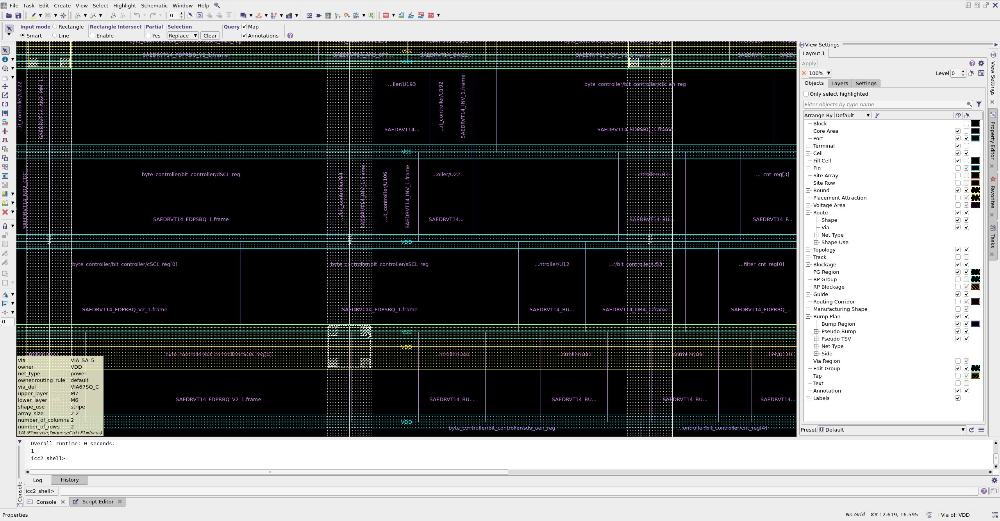

# Lab 3: Floorplan with IC Compiler II

## What is Floorplaning and IC compiler

The Floorplan step in IC Compiler (ICC) is a crucial early stage in the physical design process. It establishes the basic structure and organization of the chip. Let's break down the key aspects of floorplanning:

### 1. Purpose:

- Define the chip's overall dimensions and shape
- Allocate space for major functional blocks
- Plan the placement of I/O pads
- Establish initial power distribution network

### 2. Key Activities:

1. Core Area Definition:

   - Set the dimensions of the chip's core area
   - Define the aspect ratio (width to height ratio);

2. I/O Pad Placement:

   - Arrange input/output pads around the chip's periphery
   - Group related pads together for efficient routin

3. Macro Placement:

   - Position large, pre-designed blocks (e.g., memories, IP cores)
   - Consider proximity to related logic and I/O pads

4. Power Planning:

   - Create initial power and ground networks
   - Plan for power rings and stripes

5. Placement Blockages:

   - Define areas where standard cells cannot be placed
   - Reserve space for routing channels if necessary

6. Clock Tree Planning:

   - Identify clock sources and sinks
   - Plan initial clock distribution strategy

### 3. Typical ICC Commands:

        create_floorplan -core_utilization 0.7 -aspect_ratio 1.0
        create_io_ring
        create_power_straps -direction vertical -nets {VDD VSS}
        create_power_straps -direction horizontal -nets {VDD VSS}
        place_macro -macro_name SRAM1 -coordinate {100 100}

### 4. Considerations:

- Timing: Place critical blocks closer together
- Power: Ensure adequate power distribution
- Thermal: Distribute heat-generating blocks
- Signal Integrity: Minimize long routes for sensitive signals
- Manufacturability: Adhere to design rules and guidelines

### 5. Iterative Process:

- Floorplanning is often iterative, refined based on placement and routing results

### 6. Output:

- A DEF (Design Exchange Format) file describing the floorplan
- Various reports on area utilization, power grid, etc.

### 7. Impact on Subsequent Steps:

- Guides placement of standard cells
- Influences routing congestion and timing closure
- Affects overall chip area and performance

### 8. Advanced Techniques:

- Hierarchical floorplanning for large designs
- Voltage domain planning for multi-voltage designs
- Die-to-die interface planning for 3D ICs

### 9. Quality Metrics:

- Core utilization
- Aspect ratio
- Power grid robustness
- Estimated wire length and congestion

### 10. Tools and Visualization:

- GUI for visual floorplan editing
- Scripts for automated floorplan generation
- Analysis tools for early congestion and timing estimation

The floorplan step sets the foundation for the entire physical design process. A well-thought-out floorplan can significantly ease subsequent steps like placement, clock tree synthesis, and routing, ultimately leading to better performance, power efficiency, and manufacturability of the final chip.

## Practical part

### 1. Move to the working directory lab03

The commands:

```tcl
cd $HOME/icdesign/m3/lab03
source /home/tools/synopsys/env.sh
```

### 2. Synthesis the design using Design Compiler

```tcl
cd $HOME/icdesign/m3/lab03/syn
dc_shell -f scripts/compile.tcl 2>&1 | tee run.log
```

Here is some important parts of reports

**Area report**

    Number of ports:                          179
    Number of nets:                           870
    Number of cells:                          711
    Number of combinational cells:            554
    Number of sequential cells:               153
    Number of macros/black boxes:               0
    Number of buf/inv:                        161
    Number of references:                      20

    Combinational area:                160.328399
    Buf/Inv area:                       29.925600
    Noncombinational area:             162.992405
    Macro/Black Box area:                0.000000
    Net Interconnect area:             483.155517

    Total cell area:                   323.320804
    Total area:                        806.476321

**Power report**

    Global Operating Voltage = 0.8
    Power-specific unit information :
        Voltage Units = 1V
        Capacitance Units = 1.000000ff
        Time Units = 1ns
        Dynamic Power Units = 1uW    (derived from V,C,T units)
        Leakage Power Units = 1pW


    --------------------------------------------------------------------------------
                                           Switch   Int      Leak     Total
    Hierarchy                              Power    Power    Power    Power    %
    --------------------------------------------------------------------------------
    i2c_master_top                            4.226  126.655 1.26e+05  131.007 100.0
      byte_controller (i2c_master_byte_ctrl)
                                              2.378   82.225 8.59e+04   84.690  64.6
        bit_controller (i2c_master_bit_ctrl)
                                              2.154   61.356 6.47e+04   63.574  48.5
          sub_226 (i2c_master_bit_ctrl_DW01_dec_1_DW01_dec_2)
                                              0.210    0.132 3.45e+03    0.345   0.3
          sub_258 (i2c_master_bit_ctrl_DW01_dec_0_DW01_dec_1)
                                           2.79e-03 9.46e-04 3.33e+03 7.07e-03   0.0

**Timing report**

    clock wb_clk_i (rise edge)                              2.00       2.00
    clock network delay (ideal)                             0.00       2.00
    clock uncertainty                                      -0.30       1.70
    byte_controller/bit_controller/cnt_reg[15]/CK (SAEDRVT14_FDPRBQ_V2_1)
                                                            0.00       1.70 r
    library setup time                                     -0.01       1.69
    data required time                                                 1.69
    --------------------------------------------------------------------------
    data required time                                                 1.69
    data arrival time                                                 -0.38
    --------------------------------------------------------------------------
    slack (MET)                                                        1.31

**Qor report**

    Timing Path Group 'wb_clk_i'
    -----------------------------------
    Levels of Logic:              18.00
    Critical Path Length:          0.38
    Critical Path Slack:           1.31
    Critical Path Clk Period:      2.00
    Total Negative Slack:          0.00
    No. of Violating Paths:        0.00
    Worst Hold Violation:          0.00
    Total Hold Violation:          0.00
    No. of Hold Violations:        0.00
    -----------------------------------

### 3. Invoke IC Compiler II

The commands:

```tcl
cd $HOME/icdesign/m3/lab03/pnr
icc2_shell -gui
```


### 4. Setup target and link libraries.

The commands:

```tcl
source ../common/common.tcl
set link_library "\* saed14rvt_tt0p8v25c.db"
set target_library "saed14rvt_tt0p8v25c.db"
```

### 5. Create NDM library

The command:

```tcl
create_lib i2c_master_top.dlib -technology saed14nm_1p9m_mw.tf -ref_libs saed14rvt_frame_only.ndm
```

### 6. Setup TLU+ files

The command:

```tcl
read_parasitic_tech -tlup "saed14nm_1p9m_Cmax.tluplus saed14nm_1p9m_Cmin.tluplus" \
        -layermap saed14nm_tf_itf_tluplus.map
```

### 7. Read the design

The command:

```tcl
read_verilog ../results/i2c_master_top.v
current_design i2c_master_top
source -echo -verbose ../inputs/i2c_master_top.sdc
```


### 8. Floorplan the design

The command:

```tcl
set_ignored_layers -min_routing_layer M2 -max_routing_layer M7
set_attribute [get_layers M1] routing_direction horizontal
set_attribute [get_layers M2] routing_direction vertical
set_attribute [get_layers M3] routing_direction horizontal
set_attribute [get_layers M4] routing_direction vertical
set_attribute [get_layers M5] routing_direction horizontal
set_attribute [get_layers M6] routing_direction vertical
set_attribute [get_layers M7] routing_direction horizontal
```

These commands are setting up the routing grid for the physical design. They establish an alternating pattern of horizontal and vertical routing directions for each metal layer, which is a common practice in IC design. This alternating pattern helps in efficient routing and reduces congestion.
The overall effect is to create a routing stack where:

- M1 is horizontal (but ignored for auto-routing)
- M2 is vertical
- M3 is horizontal
- M4 is vertical
- M5 is horizontal
- M6 is vertical
- M7 is horizontal

This configuration allows for efficient routing of signals in both horizontal and vertical directions across the chip, while maintaining a structured approach to metal layer usage.

The command logs:

    licc2_shell>	set_ignored_layers -min_routing_layer M2 -max_routing_layer M7
    1
    licc2_shell>     set_attribute [get_layers M1] routing_direction horizontal
    Information: The design specific attribute override for layer 'M1' is set in the current block 'i2c_master_top', because the actual library setting may not be overwritten. (ATTR-12)
    {M1}
    icc2_shell>     set_attribute [get_layers M2] routing_direction vertical
    Information: The design specific attribute override for layer 'M2' is set in the current block 'i2c_master_top', because the actual library setting may not be overwritten. (ATTR-12)
    {M2}
    icc2_shell>     set_attribute [get_layers M3] routing_direction horizontal
    Information: The design specific attribute override for layer 'M3' is set in the current block 'i2c_master_top', because the actual library setting may not be overwritten. (ATTR-12)
    {M3}
    icc2_shell>     set_attribute [get_layers M4] routing_direction vertical
    Information: The design specific attribute override for layer 'M4' is set in the current block 'i2c_master_top', because the actual library setting may not be overwritten. (ATTR-12)
    {M4}
    icc2_shell>     set_attribute [get_layers M5] routing_direction horizontal
    Information: The design specific attribute override for layer 'M5' is set in the current block 'i2c_master_top', because the actual library setting may not be overwritten. (ATTR-12)
    {M5}
    icc2_shell>     set_attribute [get_layers M6] routing_direction vertical
    Information: The design specific attribute override for layer 'M6' is set in the current block 'i2c_master_top', because the actual library setting may not be overwritten. (ATTR-12)
    {M6}
    icc2_shell>     set_attribute [get_layers M7] routing_direction horizontal
    Information: The design specific attribute override for layer 'M7' is set in the current block 'i2c_master_top', because the actual library setting may not be overwritten. (ATTR-12)
    {M7}

Initialize the floorplan command:

```tcl
initialize_floorplan -core_utilization 0.7 \
                    -core_offset {10 10 10 10}
```


Create placement commands:

```tcl
place_pins -ports [get_ports *]
create_placement -floorplan -effort high -timing_driven
legalize_placement
```


**Global route**

```tcl
route_global -congestion_map_only true -effort high
```

The purpose of this command is to perform a global routing analysis focused on identifying potential congestion areas in the design without actually routing the signals.

The result of this command too difficult to understand, so I will skip for now.

TODO: Explain the result.

### 9. Synthesize power rails

**First, we need to remove all existing patterns, strategies and rules**

```tcl
remove_pg_via_master_rules -all
remove_pg_patterns -all
remove_pg_strategies -all
remove_pg_strategy_via_rules -all
create_net -power VDD
create_net -ground VSS
connect_pg_net -net VDD [get_pins -physical_context */VDD]
connect_pg_net -net VSS [get_pins -physical_context */VSS]
```

**Create new pattern for std_cells’ rails connection.**

```tcl
create_pg_std_cell_conn_pattern M1_rail -layers {M1} \
            -rail_width {@wtop @wbottom} -parameters {wtop wbottom}
```

The command is used to create a power grid connection pattern for standard cells on the M1 metal layer, with customizable rail widths defined by parameters. This is a critical step in ensuring effective power distribution in the IC design.

**Use the created pattern for power and ground.**

```tcl
set_pg_strategy M1_rail_strategy_pwr -core \
            -pattern {{name: M1_rail} {nets: VDD} {parameters: {0.094 0.094}}}
set_pg_strategy M1_rail_strategy_gnd -core \
            -pattern {{name: M1_rail} {nets: VSS} {parameters: {0.094 0.094}}}
```

There commands are used to define power and ground grid strategies for the core area of the design. They specify the patterns, associated nets, and parameters for the power and ground connections, ensuring effective power distribution and ground reference throughout the IC.

**Compile the rails**

```tcl
compile_pg -strategies M1_rail_strategy_pwr
compile_pg -strategies M1_rail_strategy_gnd
```

In summary, there commands are used to compile the power and ground grids in the IC design. They ensure that the power distribution network is implemented according to the specified strategies, which dictate how the VDD and VSS connections are made.


**Create power ground mesh**

```tcl
create_pg_mesh_pattern TOP_MESH_VERTICAL \
                -layers "{{vertical_layer: M6} {width: 0.3} {spacing: interleaving} {pitch: 4} {offset: 0.5} {trim: true}}"
set_pg_strategy VDDVSS_TOP_MESH_VERTICAL \
                -core \
                -pattern {{name: TOP_MESH_VERTICAL} {nets: {VSS VDD}}} \
                -extension {{{stop:design_boundary_and_generate_pin}}}
compile_pg -strategies {VDDVSS_TOP_MESH_VERTICAL} -show_phantom

create_pg_mesh_pattern TOP_MESH_HORIZONTAL \
                -layers "{{horizontal_layer: M7} {width: 0.3} {spacing: interleaving} {pitch: 4} {offset: 0.5} {trim: true}} "
set_pg_strategy VDDVSS_TOP_MESH_HORIZONTAL \
                -core \
                -pattern {{name: TOP_MESH_HORIZONTAL} {nets: {VSS VDD}}} \
                -extension {{{stop:design_boundary_and_generate_pin}}}
compile_pg -strategies {VDDVSS_TOP_MESH_HORIZONTAL}
```

These commands are used to create and compile power grid mesh patterns for both vertical and horizontal layers (M6 and M7) in the IC design.
The vertical and horizontal mesh patterns define how power (VDD) and ground (VSS) connections are distributed across the chip.
Strategies are set for both the vertical and horizontal patterns, ensuring that they are applied correctly to the core area and that pins are generated at the design boundaries.
The compilation commands finalize the power grid layout, ensuring that the design meets electrical and physical requirements for power distribution.




**Create power ring**

```tcl
create_pg_ring_pattern \
                 ring_pattern \
                 -horizontal_layer M7 -vertical_layer M6 \
                 -horizontal_width 1 -vertical_width 1 \
                 -horizontal_spacing 5 -vertical_spacing 5
set_pg_strategy RING -core -pattern {{name: ring_pattern} {nets: "VDD VSS"}}
compile_pg -strategies RING
```

There commands are used to create and compile a power grid ring pattern for the IC design:

1. Creating the Ring Pattern: The create_pg_ring_pattern command defines a ring structure for power and ground connections, specifying the layers, widths, and spacings for the connections.
2. Setting the Strategy: The set_pg_strategy command establishes how the ring pattern will be applied to the VDD and VSS nets in the core area, ensuring that both power and ground are effectively routed.
3. Compiling the Power Grid: The compile_pg command finalizes the power grid layout, implementing the ring pattern and ensuring that the design meets electrical and physical requirements for power distribution.


### 10. Check the Power/Ground net connectivity

The command:

```tcl
check_pg_connectivity -nets "VDD VSS"
```

Command logs:

```
icc2_shell> check_pg_connectivity -nets "VDD VSS"
Checking secondary net through power switch is enabled.
Secondary net will be checked together from primary net. They will be treated as the same net
Primary Net : VDD    Secondary Net:
Primary Net : VSS    Secondary Net:
Loading cell instances...
Number of Standard Cells: 707
Number of Macro Cells: 0
Number of IO Pad Cells: 0
Number of Blocks: 0
Loading P/G wires and vias...
Number of VDD Wires: 32
Number of VDD Vias: 49
Number of VDD Terminals: 20
**************Verify net VDD connectivity*****************
  Number of floating wires: 31
  Number of floating vias: 49
  Number of floating std cells: 658
  Number of floating hard macros: 0
  Number of floating I/O pads: 0
  Number of floating terminals: 20
  Number of floating hierarchical blocks: 0
************************************************************
Loading cell instances...
Loading P/G wires and vias...
Number of VSS Wires: 34
Number of VSS Vias: 64
Number of VSS Terminals: 24
**************Verify net VSS connectivity*****************
  Number of floating wires: 33
  Number of floating vias: 64
  Number of floating std cells: 654
  Number of floating hard macros: 0
  Number of floating I/O pads: 0
  Number of floating terminals: 24
  Number of floating hierarchical blocks: 0
************************************************************
Overall runtime: 0 seconds.
{PATH_29_22 PATH_29_23 PATH_29_24 PATH_29_25 PATH_29_26 PATH_29_27 PATH_29_28 PATH_29_29  ...}
```

Explain the concepts:

- Floating wires and vias: indicate that there are connections in the design that are not properly connected to the VDD or VSS nets. This means that these wires and vias are not tied to any power or ground source, which can lead to parts of the circuit not receiving the necessary power or ground reference.

- Floating standard cells: A significant number of standard cells are floating, meaning they are not connected to either the VDD or VSS nets. This is a critical issue, as it can lead to malfunctioning of the circuit, as these cells will not operate correctly without proper power and ground connections.

- Floating terminals indicate that there are pins or terminals that are not connected to the respective power or ground nets. This can affect the overall functionality of the design, especially if these terminals are meant to connect to external power or ground sources.

**Issues:** Both VDD and VSS have a considerable number of floating wires and vias, indicating that there are connections that are not properly tied to the power or ground nets. I don't known the way to fix it for now.

1. Question 1:

   Is the floorplan good?

   I had no idea for this question.

   TODO: Research more about floorplaning.

### 11. Change the utilization ratio and rerun the floorplan

When I changes the `core_utilization` from 0.7 to 0.2 like this:

```tcl
initialize_floorplan -core_utilization 0.2 \
                    -core_offset {10 10 10 10}
```

Expected Results:

1. **Core Area Allocation**:

   - The core area will now be allocated to use only **20%** of the total available area for standard cells and macros, compared to **70%** previously.
   - This results in a significantly larger unused area within the core => The core area will be bigger.

2. **Increased Routing Space**:

   - With lower utilization, there will be more space available for routing channels, which can help reduce congestion during the routing phase.
   - This can lead to improved signal integrity and timing performance.

3. **Potential for Better Timing**:

   - The increased space may allow for better placement of critical paths, potentially improving timing closure.
   - Designers may have more flexibility in placing cells to meet timing requirements.

4. **Impact on Design Density**:

   - The overall design density will decrease, which may lead to a less compact layout.
   - This could result in a larger chip area, affecting manufacturing costs.

5. **Power Distribution**:

   - A lower core utilization may improve the effectiveness of the power distribution network, as there will be fewer cells competing for power and ground connections.

6. **Design Rule Compliance**:

   - With more space, it may be easier to comply with design rules related to spacing and layout, reducing the likelihood of DRC (Design Rule Check) violations.

7. **Flexibility for Future Changes**:

   - The increased unused area provides flexibility for future design changes or additions, such as adding more functionality or optimizing existing components.

8. **Visual Representation**:
   - The floorplan may visually appear more sparse, with larger gaps between standard cells and macros.

**Summary**

Changing the `core_utilization` from **0.7** to **0.2** results in a more spacious core area, allowing for better routing, potential timing improvements, and increased flexibility for design changes. However, it may also lead to a larger chip area and reduced design density, which could impact manufacturing costs.
