# Lab 4: Placement and Route with IC Compiler II

## The concepts

1. Placement: After the floorplan is established, placement involves positioning individual cells or components within the defined areas. The goal is to optimize for performance, area, and power consumption while ensuring that the components are close enough to minimize signal delay.
2. Routing: After placement, routing connects the components using metal layers to form the necessary electrical connections. The routing process aims to minimize the length of the connections, reduce congestion, and avoid signal integrity issues.

## Practical part

### 1. Move to the working directory lab04/pnr

```tcl
cd $HOME/icdesign/m3/lab04/pnr
source /home/tools/synopsys/env.sh
```

### 2. Run the floorplan

```tcl
icc2_shell -f scripts/floorplan.tcl 2>&1 | tee run.log
```

### 3.Open the floorplaned design

```tcl
# Run ICC2 with GUI
icc2_shell -gui
# Open the library and the floorplaned design
source ../common/common.tcl
open_lib $ARC_TOP
copy_block -from_block 06_${DESIGN_NAME}_floorplan_pns_finish -to 07_${DESIGN_NAME}_place_start
open_block  07_${DESIGN_NAME}_place_start
# Run the checking
report_lib $ARC_TOP
```

### 4. Placement

**Configure options related to timing analysis and placement**

```tcl
# time.disable_recovery_removal_checks: This option controls whether recovery checks
# (which ensure that signals are stable before they are sampled) are removed
# during timing analysis.
set_app_options -name time.disable_recovery_removal_checks -value false

# time.disable_case_analysis: This option determines whether
# case analysis (which considers different signal states)
# is disabled during timing analysis. Setting this to false
# means that case analysis will be enabled,
# allowing the tool to consider different scenarios for signal states,
# which is important for accurate timing analysis.
set_app_options -name time.disable_case_analysis -value false

# place.coarse.continue_on_missing_scandef: This option controls
# whether the placement process should continue even if a scan definition
# (used for testing and verification) is missing.
# Setting this to true allows the placement process to proceed without halting due
# to the absence of a scan definition, which can be useful in early design stages
# or when the scan definition is not critical.
set_app_options -name place.coarse.continue_on_missing_scandef -value true

# opt.common.user_instance_name_prefix: This option specifies a prefix
# for user-defined instances in the design. Setting this to place means
# that all user instances will be prefixed with "place," which can help in
# organizing and identifying instances related to the placement phase.
set_app_options -name opt.common.user_instance_name_prefix -value place
```

**Perform placement, routing and timing optimizations**

```tcl
# Placement, routing and timing optimizations are performed in the multi_corner_multi_mode bases
source scripts/mcmm.tcl
```

The content of `scripts/mcmm.tcl`

```tcl
# There commands remove all previously defined corners, modes, scenarios
remove_corners -all
remove_modes -all
remove_scenarios -all

# This command creates two corners named "slow", "flast",
# which typically represents the worst-case and best-case timing conditions for the design.
create_corner slow
create_corner fast

# Reads parasitic technology data from a specified files and associates it with layer maps.
# In the first command, the data is named tlup_max, which likely represents
# the maximum parasitic effects for the fast corner. The second represents for
# the minimum parasitic effects.
read_parasitic_tech -tlup $Tlup_max_file -layermap $Map_file -name tlup_max
read_parasitic_tech -tlup $Tlup_min_file -layermap $Map_file -name tlup_min


# This command sets the parasitic parameters for the fast corner using the minimum parasitic
# specifications (tlup_min). It defines how the design will behave under fast conditions.
set_parasitics_parameters -early_spec tlup_min -late_spec tlup_min -corners {fast}
# Similar to the previous command, it defines how the design will behave under slow conditions.
set_parasitics_parameters -early_spec tlup_max -late_spec tlup_max -corners {slow}

# Modes are different operational states of the design, such as functional or test modes,
# which can affect timing analysis. This command creates a mode named "func,"
# which typically represents the functional operational state of the design.
create_mode func
# This command sets the current operational mode to "func," indicating that
# subsequent commands will be executed in the context of the functional mode.
current_mode func

# Scenarios combine modes and corners to represent specific conditions
# under which the design will be analyzed. There commands create scenarios,
# which combines the functional mode with the fast corner and
# functional mode with the slow corner.
create_scenario -mode func -corner fast -name func_fast
create_scenario -mode func -corner slow -name func_slow

# This command sets the current scenario to "func_fast," indicating that subsequent commands
# will be executed in the context of this scenario.
current_scenario func_fast
# This command reads the design constraints from the specified SDC (Synopsys Design Constraints) file
# in the context of the fast scenario.
read_sdc $DESIGN_CONSTRAINT_FILE

# Similar to the previous commands
current_scenario func_slow
read_sdc $DESIGN_CONSTRAINT_FILE
```

**Initiates the placement optimization process**

This command optimizes the placement of cells in the design based on the current settings and constraints. It aims to improve performance, area, and power consumption by rearranging the positions of the components.

```tcl
place_opt
```

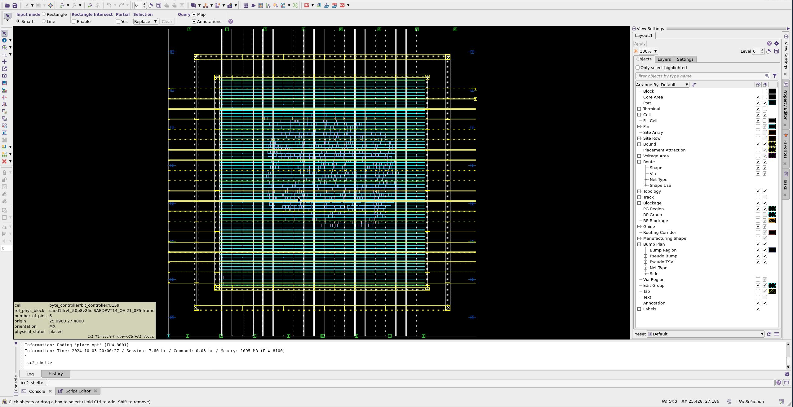

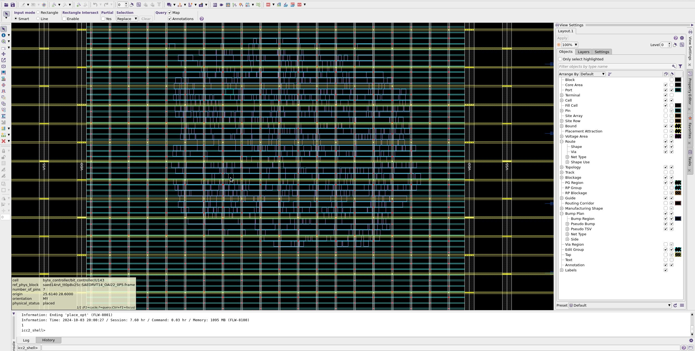

### 5. Legalize cell placement

To ensure that the placement of cells (standard cells, macros, etc.) adheres to the design rules and constraints defined by the technology being used. The `legalize_placement` command will does:

1. Compliance with Design Rules
2. Adjusting Cell Positions
3. Optimization

```tcl
legalize_placement
```

**Some log reports**

Placement Attempts Report:

```
    ****************************************
    Report : Placement Attempts
    ****************************************
    number of cells:                    689
    number of references:                81
    number of site rows:                 67
    number of locations attempted:    15518
    number of locations failed:           0  (0.0%)
```

Cell Displacements Report:

```
    ****************************************
    Report : Cell Displacements
    ****************************************
    number of cells aggregated:         689 (7162 total sites)
    avg row height over cells:        0.600 um
    rms cell displacement:            0.000 um ( 0.00 row height)
    ...
    number of cells moved:                0
```

Indicates that no cells were moved during the legalization process, with all cells remaining in their original positions.

### 6. Check the placement reports

```tcl
# This command sets the storage location for snapshots of the timing analysis results.
set_app_option -name time.snapshot_storage_location -value "./"

# This command creates a snapshot of the current quality of results (QoR) after placement.
# -significant_digits 4: Specifies that four significant digits should be used in the snapshot,
# which helps in maintaining precision in the reported results.
create_qor_snapshot -name place_qor_snp -significant_digits 4

file mkdir reports

# This command generates a report of the QoR snapshot created earlier.
report_qor_snapshot -name place_qor_snp > reports/place.qor_snapshot.rpt

# This command generates a report of the overall quality of results (QoR) for the design.
report_qor > reports/place.qor

# This command generates a report of all constraint violations in the design
report_constraints -all_violators > reports/place.con

# This command generates a timing report focusing on maximum delay conditions.
#    -capacitance: Includes capacitance information in the report.
#    -transition_time: Includes transition time data for signals.
#    -input_pins: Reports timing information related to input pins.
#    -nets: Includes timing information for nets in the design.
#    -delay_type max: Specifies that the report should focus on maximum delay conditions.
report_timing -capacitance -transition_time -input_pins -nets -delay_type max > reports/place.max.tim

# Similar to the previous command, but it focuses on minimum delay conditions.
report_timing -capacitance -transition_time -input_pins -nets -delay_type min > reports/place.min.tim
```

#### Report Overview: `place.qor_snapshot.rpt`

The report generated by the `report_qor_snapshot -name place_qor_snp` command provides a comprehensive overview of the quality of results (QoR) for the design `i2c_master_top` after placement. Here’s a detailed explanation of the report, highlighting essential information:

**Report Breakdown**

1. **Scenario Information**:

   ```
   No. of scenario = 2
   s1 = func_fast
   s2 = func_slow
   ```

   - Indicates that there are two scenarios analyzed: `func_fast` (fast corner) and `func_slow` (slow corner).

2. **Timing Analysis Results**:

   ```
   WNS of each timing group:                       s1        s2
   wb_clk_i                                    1.4373    1.4319
   ```

   - **WNS (Worst Negative Slack)**: Indicates the timing margin for the clock signal `wb_clk_i` for both scenarios. Higher values indicate better timing performance.
   - For `s1` (func_fast), the WNS is **1.4373 ns**, and for `s2` (func_slow), it is **1.4319 ns**.

3. **Setup and Hold Violations**:

   ```
   Setup WNS:                                  1.4373    1.4319      1.4319
   Setup TNS:                                  0.0000    0.0000      0.0000
   Number of setup violations:                      0         0           0
   Hold WNS:                                   0.0188    0.0192      0.0188
   Hold TNS:                                   0.0000    0.0000      0.0000
   Number of hold violations:                       0         0           0
   ```

   - **Setup WNS**: Shows the worst negative slack for setup timing checks, indicating no setup violations (0).
   - **Hold WNS**: Shows the worst negative slack for hold timing checks, with values of **0.0188 ns** for `s1` and **0.0192 ns** for `s2`, indicating no hold violations (0).

4. **Violation Counts**:

   ```
   Number of max trans violations:                  0         0           0
   Number of max cap violations:                    0         0           0
   Number of min pulse width violations:            0         0           0
   ```

   - Indicates that there are no violations for maximum transition time, maximum capacitance, or minimum pulse width for both scenarios.

5. **Area and Cell Count**:

   ```
   Area:                                                            317.993
   Cell count:                                                          689
   Buf/inv cell count:                                                  141
   Std cell utilization:                                             0.1966
   ```

   - **Area**: The total area of the design is **317.993 square micrometers**.
   - **Cell Count**: There are **689 cells** in the design.
   - **Buffer/Invert Cell Count**: There are **141 buffer/inverter cells**.
   - **Standard Cell Utilization**: The utilization of standard cells is **0.1966**, indicating that approximately 19.66% of the available area is used by standard cells.

6. **Violation Histograms**:

   ```
   Histogram:             s1   s2
   Max violations:         0    0
   ...
   Min violations:         0    0
   ```

   - Indicates that there are no maximum or minimum violations for both scenarios, confirming that the design meets the timing requirements.

7. **Snapshot Report Index**:
   ```
   Snapshot report (index) is created and can be viewed using file ".../lab04/pnr/.//index.html"
   ```
   - Indicates that a snapshot report index has been created, which can be viewed in an HTML format for easier navigation and review.

**Essential Information Summary**

- **Scenarios Analyzed**: `func_fast` and `func_slow`
- **Timing Results**:
  - No setup or hold violations.
  - WNS values indicate good timing margins (1.4373 ns for fast, 1.4319 ns for slow).
- **Area**: 317.993 square micrometers with 689 cells.
- **Standard Cell Utilization**: 19.66% is relatively low, and optimizing the design to increase this utilization is recommended.
- **No Violations**: Confirmed for maximum transition, maximum capacitance, and minimum pulse width.

#### Report overview: `place.qor`

The `place.qor` report provides a comprehensive overview of the Quality of Results (QoR) for the design `i2c_master_top`. This report includes timing analysis, cell count, area utilization, and design rule checks. Here’s a breakdown of the essential information from the report:

**Report Breakdown**

1. **Timing Analysis**:

   - **Scenario: 'func_fast'**:

     ```
     Levels of Logic:                     16
     Critical Path Length:              0.27
     Critical Path Slack:               1.44
     Critical Path Clk Period:          2.00
     Total Negative Slack:              0.00
     No. of Violating Paths:               0
     Worst Hold Violation:              0.00
     Total Hold Violation:              0.00
     No. of Hold Violations:               0
     ```

     - **Levels of Logic**: The number of logic levels in the critical path is **16**.
     - **Critical Path Length**: The length of the critical path is **0.27 ns**.
     - **Critical Path Slack**: The slack for the critical path is **1.44 ns**, indicating that the timing requirement is comfortably met.
     - **Critical Path Clock Period**: The clock period is **2.00 ns**.
     - **Total Negative Slack**: There are **0.00 ns** of negative slack, meaning no timing violations.
     - **Violating Paths**: There are **0** paths that violate timing constraints.
     - **Hold Violations**: There are **0** hold violations, indicating that the design meets hold timing requirements.

   - **Scenario: 'func_slow'**:
     ```
     Levels of Logic:                     16
     Critical Path Length:              0.27
     Critical Path Slack:               1.43
     Critical Path Clk Period:          2.00
     Total Negative Slack:              0.00
     No. of Violating Paths:               0
     Worst Hold Violation:              0.00
     Total Hold Violation:              0.00
     No. of Hold Violations:               0
     ```
     - Similar metrics as the `func_fast` scenario, with a critical path slack of **1.43 ns** and no violations.

2. **Cell Count**:

   ```
   Hierarchical Cell Count:              4
   Hierarchical Port Count:            163
   Leaf Cell Count:                    689
   Buf/Inv Cell Count:                 141
   Buf Cell Count:                       3
   Inv Cell Count:                     138
   Combinational Cell Count:           536
   Sequential Cell Count:              153
   Macro Count:                          0
   ```

   - **Hierarchical Cell Count**: Total number of hierarchical cells is **4**.
   - **Leaf Cell Count**: The total number of leaf cells is **689**.
   - **Buffer/Invert Cell Count**: There are **141** buffer/inverter cells, with **3** buffers and **138** inverters.
   - **Combinational Cell Count**: There are **536** combinational cells.
   - **Sequential Cell Count**: There are **153** sequential cells.

3. **Area Utilization**:

   ```
   Combinational Area:              155.00
   Noncombinational Area:           162.99
   Total Cell Area:                 317.99
   Net Length:                     3920.86
   ```

   - **Combinational Area**: The area occupied by combinational logic is **155.00** square units.
   - **Noncombinational Area**: The area occupied by non-combinational logic (e.g., buffers, inverters) is **162.99** square units.
   - **Total Cell Area**: The total area occupied by cells in the netlist is **317.99** square units.
   - **Net Length**: The total length of nets in the design is **3920.86** units.

4. **Design Rules**:
   ```
   Total Number of Nets:               711
   Nets with Violations:                 0
   Max Trans Violations:                 0
   Max Cap Violations:                   0
   ```
   - **Total Number of Nets**: There are **711** nets in the design.
   - **Nets with Violations**: There are **0** nets with violations, indicating compliance with design rules.
   - **Max Transition Violations**: There are **0** transition violations.
   - **Max Capacitance Violations**: There are **0** capacitance violations.

**Conclusion**

The `place.qor` report indicates that the design `i2c_master_top` meets all timing and design rule requirements, with no violations reported. The critical path slack values suggest that the design has a comfortable margin for timing, ensuring reliable operation under both fast and slow scenarios. The area utilization metrics provide insight into the efficiency of the design in terms of cell usage and net lengths. Overall, this report reflects a well-optimized design ready for further stages in the design flow.

#### Report overview: `place.max.tim`

The report file `clock_pre_route.max.tim` provides a detailed timing analysis for the design `i2c_master_top`, focusing on the maximum delay paths between specific registers in the design. This report is essential for assessing the timing performance of the design, particularly under the conditions specified. Below is a breakdown of the report's sections and their significance.

**Report Breakdown**

1.  General Information

```
****************************************
Report : timing
        -path_type full
        -delay_type max
        -max_paths 1
        -report_by design
        -input_pins
        -nets
        -transition_time
        -capacitance
Design : i2c_master_top
Version: U-2022.12
Date   : Tue Oct  8 10:56:34 2024
****************************************
```

- **Path Type**: The report is for a **full** path type, meaning it considers the entire path from the startpoint to the endpoint.
- **Delay Type**: The report focuses on **maximum** delays, which is critical for ensuring that the design meets its timing requirements under worst-case conditions.
- **Max Paths**: The report is limited to **1** maximum path, indicating that it will analyze the single worst-case path.
- **Report By**: The report is organized by **design**, summarizing the timing information for the entire design.
- **Input Pins, Nets, Transition Time, Capacitance**: These options indicate that the report includes details about input pins, nets, transition times, and capacitance.

2.  Path Information

```
  Startpoint: byte_controller/bit_controller/cnt_reg[0] (rising edge-triggered flip-flop clocked by wb_clk_i)
  Endpoint: byte_controller/bit_controller/cnt_reg[15] (rising edge-triggered flip-flop clocked by wb_clk_i)
  Mode: func
  Corner: slow
  Scenario: func_slow
  Path Group: wb_clk_i
  Path Type: max
```

- **Startpoint**: The path starts at the register `cnt_reg[0]`, which is a rising edge-triggered flip-flop clocked by `wb_clk_i`.
- **Endpoint**: The path ends at the register `cnt_reg[15]`, also a rising edge-triggered flip-flop clocked by `wb_clk_i`.
- **Mode**: The mode of operation is **functional**.
- **Corner**: The analysis is performed under the **slow** corner, which typically represents the worst-case scenario for timing.
- **Scenario**: The scenario is labeled as **func_slow**, indicating that it is a functional timing analysis under slow conditions.
- **Path Group**: The path group is associated with the clock signal `wb_clk_i`.
- **Path Type**: The path type is specified as **max**, focusing on maximum delay.

3.  Timing Path Details

```
  Point                                          Fanout    Cap      Trans      Incr      Path
  ----------------------------------------------------------------------------------------------------
  clock wb_clk_i (rise edge)                                                   0.00      0.00
  clock network delay (propagated)                                             0.03      0.03

  byte_controller/bit_controller/cnt_reg[0]/CK (SAEDRVT14_FDPRBQ_V2LP_0P5)
                                                                     0.03      0.00      0.03 r
  ...
  ...
  byte_controller/bit_controller/n147 (net)         1      0.62
  byte_controller/bit_controller/cnt_reg[15]/D (SAEDRVT14_FDPRBQ_V2LP_0P5)
                                                                     0.01      0.00      0.28 r
  data arrival time                                                                      0.28
```

- **Timing Points**: This section lists the various points along the timing path, including the clock signal, registers, nets, and logic gates.
- **Fanout**: Indicates the number of loads driven by the signal at that point.
- **Capacitance (Cap)**: The capacitance at each point, which affects the signal's transition time.
- **Transition Time (Trans)**: The time it takes for the signal to transition from low to high (or vice versa).
- **Incr**: Incremental delay contributions from each point in the path.
- **Path**: The path delay contributions are shown for each component in the timing path.

4.  Timing Analysis Summary

```
  clock wb_clk_i (rise edge)                                                   2.00      2.00
  clock network delay (propagated)                                             0.02      2.02
  byte_controller/bit_controller/cnt_reg[15]/CK (SAEDRVT14_FDPRBQ_V2LP_0P5)
                                                                     0.03      0.00      2.02 r
  clock uncertainty                                                           -0.30      1.72
  library setup time                                                          -0.00      1.72
  data required time                                                                     1.72
  ----------------------------------------------------------------------------------------------------
  data required time                                                                     1.72
  data arrival time                                                                     -0.28
  ----------------------------------------------------------------------------------------------------
  slack (MET)                                                                            1.44
```

- **Data Required Time**: The time by which the data must arrive at the endpoint is **1.72 ns**.
- **Data Arrival Time**: The calculated arrival time of the data is **-0.28 ns**, indicating that the data arrives later than required.
- **Slack**: The slack value is **1.44 ns**, which indicates that the timing is comfortably met. Positive slack means that the design meets the timing requirements, while negative slack indicates a timing violation.

**Summary**

The `clock_pre_route.max.tim` report provides a comprehensive analysis of the maximum timing path between two registers in the `i2c_master_top` design. Key highlights include:

- **Start and Endpoint**: The path starts at `cnt_reg[0]` and ends at `cnt_reg[15]`, both clocked by `wb_clk_i`.
- **Timing Analysis**: The report shows detailed timing information, including fanout, capacitance, and transition times for each point in the path.
- **Data Timing**: The data required time is **1.72 ns**, while the data arrival time is **-0.28 ns**, indicating a timing issue.
- **Slack**: The slack is **1.44 ns**, suggesting that the design meets the timing requirements with a comfortable margin.

#### Report overview: `place.min.tim`

**Report Breakdown**

1.  General Information

```
****************************************
Report : timing
        -path_type full
        -delay_type min
        -max_paths 1
        -report_by design
        -input_pins
        -nets
        -transition_time
        -capacitance
Design : i2c_master_top
Version: U-2022.12
Date   : Thu Oct  3 20:58:50 2024
****************************************
```

- **Path Type**: The report is for a **full** path type, meaning it considers the entire path from the startpoint to the endpoint.
- **Delay Type**: The report focuses on **minimum** delays, which is critical for ensuring that the design meets its timing requirements.
- **Max Paths**: The report is limited to **1** maximum path, indicating that it will analyze the single best path.
- **Report By**: The report is organized by **design**, meaning it summarizes the timing information for the entire design.
- **Input Pins, Nets, Transition Time, Capacitance**: These options indicate that the report includes details about input pins, nets, transition times, and capacitance.

2.  Path Information

```
  Startpoint: byte_controller/bit_controller/cSCL_reg[0] (rising edge-triggered flip-flop clocked by wb_clk_i)
  Endpoint: byte_controller/bit_controller/cSCL_reg[1] (rising edge-triggered flip-flop clocked by wb_clk_i)
  Mode: func
  Corner: fast
  Scenario: func_fast
  Path Group: wb_clk_i
  Path Type: min
```

- **Startpoint**: The path starts at the register `cSCL_reg[0]`, which is a rising edge-triggered flip-flop clocked by `wb_clk_i`.
- **Endpoint**: The path ends at the register `cSCL_reg[1]`, also a rising edge-triggered flip-flop clocked by `wb_clk_i`.
- **Mode**: The mode of operation is **functional**.
- **Corner**: The analysis is performed under the **fast** corner, which typically represents the best-case scenario for timing.
- **Scenario**: The scenario is labeled as **func_fast**, indicating that it is a functional timing analysis under fast conditions.
- **Path Group**: The path group is associated with the clock signal `wb_clk_i`.
- **Path Type**: The path type is specified as **min**, focusing on minimum delay.

3.  Timing Path Details

```
  Point                                          Fanout    Cap      Trans      Incr      Path
  ----------------------------------------------------------------------------------------------------
  clock wb_clk_i (rise edge)                                                   0.00      0.00
  clock network delay (ideal)                                                  0.00      0.00

  byte_controller/bit_controller/cSCL_reg[0]/CK (SAEDRVT14_FDPRBQ_V2LP_1)
                                                                     0.20      0.00      0.00 r
  ...
  ...
  byte_controller/bit_controller/N71 (net)          1      0.33
  byte_controller/bit_controller/cSCL_reg[1]/D (SAEDRVT14_FDPRBQ_V2LP_1)
                                                                     0.00      0.00      0.07 f
  data arrival time                                                                      0.07
```

- **Timing Points**: This section lists the various points along the timing path, including the clock signal, registers, nets, and logic gates.
- **Fanout**: Indicates the number of loads driven by the signal at that point.
- **Capacitance (Cap)**: The capacitance at each point, which affects the signal's transition time.
- **Transition Time (Trans)**: The time it takes for the signal to transition from low to high (or vice versa).
- **Incr**: Incremental delay contributions from each point in the path.
- **Path**: The path delay contributions are shown for each component in the timing path.

4.  Timing Analysis Summary

```
  clock wb_clk_i (rise edge)                                                   0.00      0.00
  clock network delay (ideal)                                                  0.00      0.00
  byte_controller/bit_controller/cSCL_reg[1]/CK (SAEDRVT14_FDPRBQ_V2LP_1)
                                                                     0.20      0.00      0.00 r
  library hold time                                                            0.05      0.05
  data required time                                                                     0.05
  ----------------------------------------------------------------------------------------------------
  data required time                                                                     0.05
  data arrival time                                                                     -0.07
  ----------------------------------------------------------------------------------------------------
  slack (MET)                                                                            0.02
```

- **Data Required Time**: The time by which the data must arrive at the endpoint is **0.05 ns**.
- **Data Arrival Time**: The calculated arrival time of the data is **-0.07 ns**, indicating that the data arrives later than required.
- **Slack**: The slack value is **0.02 ns**, which indicates that the timing is marginally met. Positive slack means that the design meets the timing requirements, while negative slack indicates a timing violation.

**Summary**

The `place.min.tim` report provides a comprehensive analysis of the minimum timing path between two registers in the `i2c_master_top` design. Key highlights include:

- **Start and Endpoint**: The path starts at `cSCL_reg[0]` and ends at `cSCL_reg[1]`, both clocked by `wb_clk_i`.
- **Timing Analysis**: The report shows detailed timing information, including fanout, capacitance, and transition times for each point in the path.
- **Data Timing**: The data required time is **0.05 ns**, while the data arrival time is **-0.07 ns**, indicating a timing issue.
- **Slack**: The slack is **0.02 ns**, suggesting that while the design is close to meeting timing, it may require further optimization to ensure reliable operation.

### 7. Clock Tree Synthesis (CTS)

#### Verify that the placement is legal

```tcl
# This command generates a detailed report on the legality of the block design i2c_master_top.
# This report ensures that the design adheres to various placement and routing rules,
# highlighting any violations that may impact the physical implementation of the design.
check_legality –verbose
```

The Legality report

```
VIOLATIONS BY CATEGORY:
   MOVABLE  APP-FIXED USER-FIXED  DESCRIPTION
         0          0          0  Two objects overlap.
         0          0          0  A cell violates a pnet.
         0          0          0  A cell is illegal at a site.
         0          0          0  A cell is not aligned with a site.
         0          0          0  A cell has an illegal orientation.
         0          0          0  A cell spacing rule is violated.
         0          0          0  A layer rule is violated.
         0          0          0  A cell is in the wrong region.
         0          0          0  Two cells violate cts margins.
         0          0          0  Two cells violate coloring.

         0          0          0  TOTAL

TOTAL 0 Violations.
```

Total Violations: There are 0 violations reported in the design, indicating that the design complies with the specified placement and routing rules.

#### The estimated QoR for the design must meet the requirements

As we see in the [place.qor.rpt](#report-overview-placeqor) and [place.qor_snapshot.rpt](#report-overview-placeqor_snapshotrpt). There is no violation in this design.

#### Logical, physical libraries and TLU+ files must be provided.

As we did by the `source ../common/common.tcl` command in the [`Open the floorplaned design`](#3open-the-floorplaned-design). The `common.tcl` file declares all the libraries used by the IC II compiler, they are:

1. Logical Libraries

Logical libraries contain the logical representations of the cells used in the design, including their timing and functional characteristics. In the `common.tcl` file, the following entries represent logical libraries:

- **Standard Cell Library**:

  ```tcl
  set STD_CELL_LIB "${DESIGN_REF_PATH}/stdcell_rvt/db_nldm/saed14rvt_tt0p8v25c.db"
  ```

  - This file contains the logical definitions and timing information for the standard cells used in the design.

- **RAM Library**:
  ```tcl
  set RAM_LIB "${DESIGN_REF_PATH}/sram/logic_synth/dual/saed14sram_tt0p8v25c.db"
  ```
  - This file contains the logical definitions and timing information for the SRAM cells used in the design.

2. Physical Libraries

Physical libraries provide the physical characteristics of the cells, including layout information and design rules. In the `common.tcl` file, the following entries represent physical libraries:

- **Technology Files**:

  ```tcl
  set Tech_file "${DESIGN_REF_MW_PATH}/saed14nm_1p9m_mw.tf"
  ```

  - This file contains technology-specific information, including design rules and layer information.

- **GDS File for Standard Cells**:
  ```tcl
  set Std_cell_gds "${DESIGN_REF_LIB_PATH}/stdcell_rvt/gds/saed14rvt.gds"
  ```
  - This GDS file contains the geometric layout of the standard cells.

3. TLU+ Files

TLU+ (Timing Library Update) files provide timing information for the cells in a format that can be utilized by synthesis and timing analysis tools. In the `common.tcl` file, the following entries represent TLU+ files:

- **Timing Library Update Files**:

  ```tcl
  set Tlup_max_file "${DESIGN_REF_RC_PATH}/max/saed14nm_1p9m_Cmax.tluplus"
  set Tlup_min_file "${DESIGN_REF_RC_PATH}/min/saed14nm_1p9m_Cmin.tluplus"
  ```

  - These files contain updated timing information for the cells under different conditions (maximum and minimum).

#### Verify that the clock sources are correctly defined

```tcl
# This command provides a detailed analysis of the clock tree synthesis (CTS) for the design.
# This log includes information about clock definitions, reference cells, skew balancing,
# multi-voltage considerations, capacitance and transition constraints,
# and any other issues that may affect the clock tree
check_clock_trees
```

**Log Breakdown**

1. **General Information**:

   ```
   Information: The value of option cts.compile.enable_cell_relocation has been overridden to "leaf_only" to support latency-driven placement. (CTS-973)
   Information: CTS will work on the following scenarios. (CTS-101)
      func_fast    (Mode: func; Corner: fast)
      func_slow    (Mode: func; Corner: slow)
   Information: CTS will work on all clocks in active scenarios, including 1 master clock and 0 generated clocks. (CTS-107)
   ```

   - The log indicates that the CTS process is set to work on two scenarios: `func_fast` and `func_slow`.
   - It mentions that there is **1 master clock** and **0 generated clocks** in the design.

2. **Output Units**:

   ```
   Output units used in this log:
      Time        : 1.00ns
      Resistance  : 1.00MOhm
      Capacitance : 1.00fF
      Power       : 1.00pW
      Length      : 1.00um
   ```

   - The log specifies the units used for various measurements, which is standard for clarity in timing and electrical characteristics.

3. **Clock Definitions & Propagation Summary**:

   ```
   ---------------------------------------------
   Clock Definitions & Propagation
   ---------------------------------------------
   CTS-002       0         None      There are active CTS scenarios with no clock definition.
   CTS-004       0         None      There are generated clocks that cannot be reached by their master clock.
   CTS-005       0         None      Generated clocks defined on bidirectional pins
   CTS-019       0         None      Clocks propagate to output ports
   CTS-905       0         None      There are clocks with no sinks
   CTS-906       0         None      There are sinks with no clock
   CTS-907       0         None      There are disabled timing arcs in the clock network
   ```

   - All counts are **0**, indicating that there are no issues related to clock definitions and propagation. Specifically:
     - No active scenarios lack clock definitions.
     - No generated clocks are unreachable.
     - No clocks are defined on bidirectional pins.
     - Clocks propagate correctly to output ports.
     - No clocks are without sinks, and no sinks are without clocks.

4. **Reference Cells Summary**:

   ```
   ---------------------------------------------
   Reference Cells
   ---------------------------------------------
   CTS-007       0         None      Failed to specify any clock buffers or inverters for CTS
   CTS-008       0         None      Clock reference cells have dont_touch or dont_use
   CTS-903       0         None      Cells instantiated in the clock network are not in the clock reference list
   CTS-904       1         None      Some clock reference cells have no LEQ cell specified for resizing
   ```

   - **CTS-904** indicates a warning: "Some clock reference cells have no LEQ cell specified for resizing." This means that at least one clock reference cell (specifically `SAEDRVT14_FSDPRBQ_V2LP_0P5` in the instance `byte_controller/bit_controller/cSDA_reg[1]`) does not have a corresponding LEQ (Low Equivalent Quality) cell defined for resizing, which could affect the clock tree's performance.

5. **Skew Balancing Summary**:

   ```
   ---------------------------------------------
   Skew Balancing
   ---------------------------------------------
   All counts are 0, indicating no issues with skew balancing.
   ```

6. **Multi-Voltage Summary**:

   ```
   ---------------------------------------------
   Multi-Voltage
   ---------------------------------------------
   All counts are 0, indicating no multi-voltage violations.
   ```

7. **Capacitance & Transition Constraints Summary**:

   ```
   ---------------------------------------------
   Capacitance & Transition Constraints
   ---------------------------------------------
   All counts are 0, indicating no issues with capacitance or transition constraints.
   ```

8. **Other Issues Summary**:
   ```
   ---------------------------------------------
   Other issues
   ---------------------------------------------
   All counts are 0, indicating no other issues in the clock network.
   ```

**Conclusion**

**Are clock sources correctly defined?**

- **Yes**, the log indicates that the clock sources are correctly defined in terms of propagation and definitions. There are no violations or issues related to clock definitions, propagation, or multi-voltage constraints.

**Essential Information Summary**

- **Active Scenarios**: `func_fast`, `func_slow`
- **Master Clocks**: 1
- **Generated Clocks**: 0
- **Clock Definitions Issues**: 0
- **Reference Cells Issues**: 1 warning regarding LEQ cell specification
- **Skew Balancing Issues**: 0
- **Multi-Voltage Issues**: 0
- **Capacitance & Transition Issues**: 0
- **Other Issues**: 0

#### Set clock tree options

```tcl
# This command sets the layers that should be ignored during the routing process.
set_ignored_layers -min_routing_layer ${MIN_ROUTING_LAYER} -max_routing_layer ${MAX_ROUTING_LAYER}

# This command indicating that cell relocation should be applied to all cells in the design
# during the CTS phase. This can help optimize the clock tree by allowing the tool
# to reposition cells as needed.
set_app_options -name cts.compile.enable_cell_relocation -value all

# This command indicating that the tool should resize existing cells to align with
# the clock tree references. This can help ensure that the clock tree is properly balanced
# and meets timing requirements.
set_app_options -name cts.compile.size_pre_existing_cell_to_cts_references -value true

# This sets the target skew for the clock tree to 0.1 ns. Skew refers to the difference
# in arrival times of the clock signal at different points in the circuit.
# Setting a target skew helps ensure that the clock signal arrives at all relevant points
# within the specified timing margin, which is critical for synchronous circuit operation.
set_clock_tree_options -clocks [all_clocks] -target_skew 0.1
```

#### Set reference cells for clock tree synthesis

```tcl
# This command indicates that the specified cells will be recognized as valid components
# for use in the clock tree synthesis(CTS) process.
set_lib_cell_purpose -include cts { \
                 */SAEDRVT14_INV_1 \
                 */SAEDRVT14_INV_2 \
                 */SAEDRVT14_INV_4 \
                 */SAEDRVT14_INV_8 \
                 */SAEDRVT14_INV_16 \
                 */SAEDRVT14_INV_20 \
                 */SAEDRVT14_BUF_2 \
                 */SAEDRVT14_BUF_4 \
                 */SAEDRVT14_BUF_6 \
                 */SAEDRVT14_BUF_8 \
                 */SAEDRVT14_BUF_16 \
                 */SAEDRVT14_BUF_20 }
```

**Command Breakdown**

1. **`set_lib_cell_purpose`**:

   - This is the main command used to define or modify the purpose of specific library cells within the design environment. The purpose of a cell can dictate how it is treated during various design processes, such as synthesis, placement, and clock tree synthesis.

2. **`-include cts`**:

   - This option specifies that the purpose being set is related to clock tree synthesis (CTS). By including `cts`, the command indicates that the specified cells will be recognized as valid components for use in the clock tree synthesis process.

3. **`{ ... }`**:

   - The curly braces `{ ... }` enclose a list of cell names that are being defined or modified. Each cell listed within the braces will have its purpose set to be included in the CTS process.

4. **Cell Names**:
   - The list of cells specified includes various types of inverters and buffers from the library:
     - **Inverters**:
       - `*/SAEDRVT14_INV_*`
     - **Buffers**:
       - `*/SAEDRVT14_BUF_*`
   - The asterisk (`*`) before the cell names indicates that these cells can be found in any library path, allowing for flexibility in locating the cells within the design environment.

**Purpose of the Command**

The purpose of this command is to ensure that the specified inverters and buffers are recognized as valid components for the clock tree synthesis process. By setting their purpose to include CTS, the design tools will consider these cells when constructing the clock tree, allowing for proper buffering and signal integrity management in the clock distribution network.

**Importance in Clock Tree Synthesis**

- **Inverters and Buffers**: Inverters and buffers are critical in clock tree synthesis as they help manage signal integrity, drive strength, and timing characteristics of the clock signal. Properly including them in the CTS process ensures that the clock tree can be optimized for performance and reliability.
- **Flexibility**: By using the `set_lib_cell_purpose` command, designers can customize which cells are available for use in the CTS process, allowing for better control over the design's clock distribution strategy.

**Summary**

In summary, the command `set_lib_cell_purpose -include cts { ... }` is used to designate specific inverters and buffers as valid components for clock tree synthesis. This helps ensure that the clock distribution network is effectively designed, maintaining signal integrity and meeting timing requirements during the synthesis process.

#### Apply the clock tree settings

```tcl
# This command sets clock uncertainty for all clocks
set_clock_uncertainty 0.1 [all_clocks]

# This command is used to define a new routing rule that specifies the spacing requirements
# for different metal layers:
#     - M2 0.3: The spacing between clock signals in metal layer 2 (M2) must be at least 0.3 micrometers (µm).
#     - M3 0.5: The spacing between clock signals in metal layer 3 (M3) must be at least 0.5 µm.
#     - M4 0.7: The spacing between clock signals in metal layer 4 (M4) must be at least 0.7 µm.
create_routing_rule CLK_SPACING -spacings {M2 0.3 M3 0.5 M4 0.7}

# This command applies the previously defined clock spacing rules to specific routing layers.
set_clock_routing_rules -rules CLK_SPACING -min_routing_layer M2 -max_routing_layer M4

# This command generates a report of the current clock settings in the design.
report_clock_settings
```

**Report Breakdown**

1.  General Information

```
Information: The value of option cts.compile.enable_cell_relocation has been overridden to "leaf_only" to support latency-driven placement. (CTS-973)
****************************************
 Report : clock settings
 Design : 07_i2c_master_top_place_start
 Date   : Mon Oct  7 17:05:33 2024
****************************************
```

- **Design Name**: `07_i2c_master_top_place_start`
- **Date**: The report was generated on **Mon Oct 7, 2024**.
- **Information**: Indicates that the option for cell relocation during CTS has been set to "leaf_only," which is relevant for optimizing placement based on latency.

2.  Configurations

```
======================================
Configurations
======================================

##Global
  Corner = fast
    Max transition: around 0.500 (default)
    Max capacitance: 600.000 (default)
    Target skew: 0 (default)
    Target latency: Not specified
  Corner = slow
    Max transition: around 0.500 (default)
    Max capacitance: 600.000 (default)
    Target skew: 0 (default)
    Target latency: Not specified

##wb_clk_i
  Corner = fast
    Max transition: around 0.500 (default)
    Max capacitance: 600.000 (default)
    Target skew: 0 (default)
    Target latency: Not specified
  Corner = slow
    Max transition: around 0.500 (default)
    Max capacitance: 600.000 (default)
    Target skew: 0.100
    Target latency: Not specified
```

- **Global Configurations**:

  - **Fast Corner**:
    - Max Transition: **0.500 ns** (default)
    - Max Capacitance: **600.000 fF** (default)
    - Target Skew: **0 ns** (default)
    - Target Latency: Not specified
  - **Slow Corner**:
    - Max Transition: **0.500 ns** (default)
    - Max Capacitance: **600.000 fF** (default)
    - Target Skew: **0.100 ns**
    - Target Latency: Not specified

- **Clock `wb_clk_i` Configurations**:
  - Similar settings as the global configurations, with a specified target skew of **0.100 ns** for the slow corner.

3.  Routing Rules

```
======================================
Routing Rules
======================================

##Global
Routing rule for sink nets: Not specified
Routing rule for internal nets: Not specified
Routing rule for root nets: Not specified
Routing rule for all nets: CLK_SPACING  Min Layer:M2 Max Layer:M4
Net-based routing rules (by set_clock_routing_rule): Not specified
Net-based routing rules (by set_routing_rule): Not specified

##wb_clk_i
Routing rule for sink nets: Not specified
Routing rule for internal nets: Not specified
Routing rule for root nets: Not specified
Routing rule for all nets: Not specified
Net-based routing rules (by set_clock_routing_rule): Not specified
Net-based routing rules (by set_routing_rule): Not specified
```

- **Global Routing Rules**:

  - **Routing Rule for All Nets**: The `CLK_SPACING` rule is applied, specifying a minimum layer of **M2** and a maximum layer of **M4** for clock signal spacing.
  - Other routing rules for sink, internal, and root nets are not specified.

- **Clock `wb_clk_i` Routing Rules**:
  - No specific routing rules are defined for the `wb_clk_i` clock signal.

4.  Buffers and Inverters

```
======================================
Buffers and Inverters
======================================

##Buffers
Name                                   Area      Max Transition       Max Load
------------------------------------------------------------------------------
saed14rvt_tt0p8v25c/SAEDRVT14_BUF_10
                                      0.710                 inf        387.800
...
saed14rvt_tt0p8v25c/SAEDRVT14_BUF_S_8
                                      0.488                 inf        299.900
...
##Inverters
Name                                   Area      Max Transition       Max Load
------------------------------------------------------------------------------
saed14rvt_tt0p8v25c/SAEDRVT14_INV_0P5
                                      0.178                 inf         19.670
...
saed14rvt_tt0p8v25c/SAEDRVT14_INV_S_8
                                      0.488                 inf        299.900
...
```

- **Buffers**: A list of buffer cells with their respective area, maximum transition time, and maximum load they can drive. For example:
  - `SAEDRVT14_BUF_10`: Area = **0.710**, Max Load = **387.800 fF**.
- **Inverters**: A list of inverter cells with similar metrics. For example:
  - `SAEDRVT14_INV_0P5`: Area = **0.178**, Max Load = **19.670 fF**.

5.  Spacing Rules

```
======================================
Spacing Rules
======================================

##By design
No by design spacing rule is specified

##By clock
No by clock spacing rule is specified

##By libcell
No by libcell spacing rule is specified

##By clock and libcell
No by clock and libcell spacing rule is specified
```

- **Spacing Rules**: Indicates that there are no specific spacing rules defined by design, clock, libcell, or a combination of clock and libcell. This means that the only spacing rule in effect is the `CLK_SPACING` rule defined earlier.

**Summary of Essential Information**

- **Design Name**: `07_i2c_master_top_place_start`
- **Date of Report**: **Mon Oct 7, 2024**
- **Clock Configurations**:
  - **Max Transition**: **0.500 ns** (default for both corners)
  - **Max Capacitance**: **600.000 fF** (default for both corners)
  - **Target Skew**: **0 ns** (fast), **0.100 ns** (slow)
- **Routing Rules**:
  - **Global Rule**: `CLK_SPACING` applied for clock signal spacing between layers M2 and M4.
- **Buffers and Inverters**: Lists of available buffers and inverters with their respective areas and load capabilities.
- **Spacing Rules**: No additional spacing rules specified beyond the `CLK_SPACING` rule.

#### Perform clock tree synthesis

```tcl
# This sets the prefix for user instance names to "clock". As a result, any instances created
# during the design process that are related to clocks will have names prefixed with "clock".
# For example, an instance might be named clock_buffer_1 or clock_inv_2.
set_app_options -name opt.common.user_instance_name_prefix -value clock

# I don't known why we need to run this command again
# TODO: find the answer to this
source scripts/mcmm.tcl

# This command performs clock optimization and will focus on the clock path associated with build_clock
# I don't unerstand the -from and to -to option, what does they do?
# TODO: find the answer to this
clock_opt -from build_clock -to build_clock
```

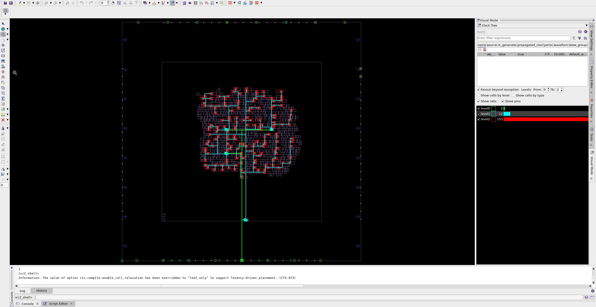
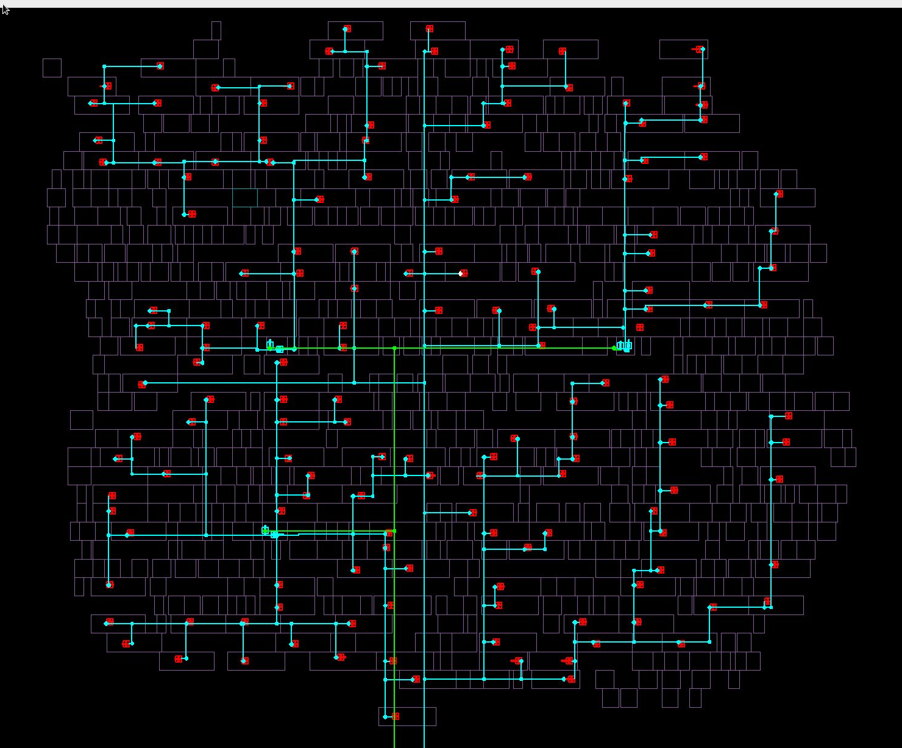

### 8. Clock tree synthesis report

```tcl
# This sets the location where snapshots will be stored
set_app_option -name time.snapshot_storage_location -value "./"

# This command is used to capture the current state of the design's QoR metrics,
# which can include timing, area, power, and other performance indicators.
# The digit is set to 4, which means that the snapshot will report values
# with four significant digits of precision.
create_qor_snapshot -name clock_pre_route -significant_digits 4

# This command generates a report of the QoR snapshot created earlier.
report_qor_snapshot -name clock_pre_route > reports/clock_pre_route.qor_snapshot.rpt

# This command generates a comprehensive report that includes various QoR metrics
# such as timing, area, and power.
report_qor > reports/clock_pre_route.qor

# This command generates a report detailing the constraints applied to the design
# and any violations that may exist.
report_constraints -all_violators > reports/clock_pre_route.con

# This command generates a timing report focusing on maximum delay characteristics.
# That includes capacitance information, transition time information for the signals,
# details about the input pins, information about the nets in the design.
report_timing -capacitance -transition_time -input_pins -nets -delay_type max > reports/clock_pre_route.max.tim

# Similar to the previous command, but it focusing on minimum delay
report_timing -capacitance -transition_time -input_pins -nets -delay_type min > reports/clock_pre_route.min.tim
```

#### Report Overview: `clock_pre_route.qor_snapshot.rpt`

```
***********************************************
Report          : create_qor_snapshot (clock_pre_route)
Design          : i2c_master_top
Version         : U-2022.12
Date            : Tue Oct  8 10:54:48 2024
Time unit       : 1.00ns
Resistance unit : 1.00MOhm
Capacitance unit: 1.00fF
Voltage unit    : 1.00V
Current unit    : 1.00uA
Power unit      : 1.00pW
Location        : ***/m3/lab04/pnr/./
***********************************************
No. of scenario = 2
s1 = func_fast
s2 = func_slow
------------------------------------------------------------------------
WNS of each timing group:                       s1        s2
------------------------------------------------------------------------
wb_clk_i                                    1.4486    1.4427
------------------------------------------------------------------------
Setup WNS:                                  1.4486    1.4427      1.4427
Setup TNS:                                  0.0000    0.0000      0.0000
Number of setup violations:                      0         0           0
Hold WNS:                                   0.0235    0.0229      0.0229
Hold TNS:                                   0.0000    0.0000      0.0000
Number of hold violations:                       0         0           0
Number of max trans violations:                  0         0           0
Number of max cap violations:                    0         0           0
Number of min pulse width violations:            0         0           0
------------------------------------------------------------------------
Area:                                                            319.902
Cell count:                                                          693
Buf/inv cell count:                                                  145
Std cell utilization:                                             0.1977
CPU(s):                                                             8012
Mem(Mb):                                                            1810
Host name:                                                          ****
------------------------------------------------------------------------
Histogram:             s1   s2
------------------------------------------------------------------------
Max violations:         0    0
   above ~ -0.7  ---    0    0
    -0.6 ~ -0.7  ---    0    0
    -0.5 ~ -0.6  ---    0    0
    -0.4 ~ -0.5  ---    0    0
    -0.3 ~ -0.4  ---    0    0
    -0.2 ~ -0.3  ---    0    0
    -0.1 ~ -0.2  ---    0    0
       0 ~ -0.1  ---    0    0
------------------------------------------------------------------------
Min violations:         0    0
  -0.06 ~ above  ---    0    0
  -0.05 ~ -0.06  ---    0    0
  -0.04 ~ -0.05  ---    0    0
  -0.03 ~ -0.04  ---    0    0
  -0.02 ~ -0.03  ---    0    0
  -0.01 ~ -0.02  ---    0    0
      0 ~ -0.01  ---    0    0
------------------------------------------------------------------------
Snapshot report (index) is created and can be viewed using file "***/m3/lab04/pnr/.//index.html"

```

_**Note**: See [place.qor_snapshot.rpt](#report-overview-placeqor_snapshotrpt) to understand this report_

#### Report Overview: `clock_pre_route.qor`

```
****************************************
Report : qor
Design : i2c_master_top
Version: U-2022.12
Date   : Tue Oct  8 10:55:54 2024
****************************************


Scenario           'func_fast'
Timing Path Group  'wb_clk_i'
----------------------------------------
Levels of Logic:                     16
Critical Path Length:              0.24
Critical Path Slack:               1.45
Critical Path Clk Period:          2.00
Total Negative Slack:              0.00
No. of Violating Paths:               0
Worst Hold Violation:              0.00
Total Hold Violation:              0.00
No. of Hold Violations:               0
----------------------------------------

Scenario           'func_slow'
Timing Path Group  'wb_clk_i'
----------------------------------------
Levels of Logic:                     16
Critical Path Length:              0.25
Critical Path Slack:               1.44
Critical Path Clk Period:          2.00
Total Negative Slack:              0.00
No. of Violating Paths:               0
Worst Hold Violation:              0.00
Total Hold Violation:              0.00
No. of Hold Violations:               0
----------------------------------------


Cell Count
----------------------------------------
Hierarchical Cell Count:              4
Hierarchical Port Count:            169
Leaf Cell Count:                    693
Buf/Inv Cell Count:                 145
Buf Cell Count:                       7
Inv Cell Count:                     138
CT Buf/Inv Cell Count:                0
Combinational Cell Count:           540
   Single-bit Isolation Cell Count:                        0
   Multi-bit Isolation Cell Count:                         0
   Isolation Cell Banking Ratio:                           0.00%
   Single-bit Level Shifter Cell Count:                    0
   Multi-bit Level Shifter Cell Count:                     0
   Level Shifter Cell Banking Ratio:                       0.00%
   Single-bit ELS Cell Count:                              0
   Multi-bit ELS Cell Count:                               0
   ELS Cell Banking Ratio:                                 0.00%
Sequential Cell Count:              153
   Integrated Clock-Gating Cell Count:                     0
   Sequential Macro Cell Count:                            0
   Single-bit Sequential Cell Count:                       153
   Multi-bit Sequential Cell Count:                        0
   Sequential Cell Banking Ratio:                          0.00%
   BitsPerflop:                                            1.00
Macro Count:                          0
----------------------------------------


Area
----------------------------------------
Combinational Area:              156.91
Noncombinational Area:           162.99
Buf/Inv Area:                     27.22
Total Buffer Area:                 2.71
Total Inverter Area:              24.51
Macro/Black Box Area:              0.00
Net Area:                             0
Net XLength:                    2085.77
Net YLength:                    2225.42
----------------------------------------
Cell Area (netlist):                            319.90
Cell Area (netlist and physical only):          319.90
Net Length:                     4311.18


Design Rules
----------------------------------------
Total Number of Nets:               715
Nets with Violations:                 0
Max Trans Violations:                 0
Max Cap Violations:                   0
----------------------------------------

1
```

_**Note**: See [place.qor](#report-overview-placeqor) to understand this report_

#### Report Overview: `clock_pre_route.min.tim`

```
****************************************
Report : timing
        -path_type full
        -delay_type min
        -max_paths 1
        -report_by design
        -input_pins
        -nets
        -transition_time
        -capacitance
Design : i2c_master_top
Version: U-2022.12
Date   : Tue Oct  8 10:56:44 2024
****************************************

  Startpoint: byte_controller/bit_controller/cSCL_reg[0] (rising edge-triggered flip-flop clocked by wb_clk_i)
  Endpoint: byte_controller/bit_controller/cSCL_reg[1] (rising edge-triggered flip-flop clocked by wb_clk_i)
  Mode: func
  Corner: slow
  Scenario: func_slow
  Path Group: wb_clk_i
  Path Type: min

  Point                                          Fanout    Cap      Trans      Incr      Path
  ----------------------------------------------------------------------------------------------------
  clock wb_clk_i (rise edge)                                                   0.00      0.00
  clock network delay (propagated)                                             0.02      0.02

  byte_controller/bit_controller/cSCL_reg[0]/CK (SAEDRVT14_FDPRBQ_V2LP_1)
                                                                     0.02      0.00      0.02 r
  ...
  ...
  byte_controller/bit_controller/cSCL_reg[1]/D (SAEDRVT14_FDPRBQ_V2LP_1)
                                                                     0.00      0.00      0.06 f
  data arrival time                                                                      0.06

  clock wb_clk_i (rise edge)                                                   0.00      0.00
  clock network delay (propagated)                                             0.02      0.02
  byte_controller/bit_controller/cSCL_reg[1]/CK (SAEDRVT14_FDPRBQ_V2LP_1)
                                                                     0.03      0.00      0.02 r
  library hold time                                                            0.01      0.04
  data required time                                                                     0.04
  ----------------------------------------------------------------------------------------------------
  data required time                                                                     0.04
  data arrival time                                                                     -0.06
  ----------------------------------------------------------------------------------------------------
  slack (MET)                                                                            0.02


1
```

_**Note**: See [place.min.tim](#report-overview-placemintim) to understand this report_

#### Report Overview: `clock_pre_route.max.tim`

```
****************************************
Report : timing
        -path_type full
        -delay_type max
        -max_paths 1
        -report_by design
        -input_pins
        -nets
        -transition_time
        -capacitance
Design : i2c_master_top
Version: U-2022.12
Date   : Tue Oct  8 10:56:34 2024
****************************************

  Startpoint: byte_controller/bit_controller/cnt_reg[0] (rising edge-triggered flip-flop clocked by wb_clk_i)
  Endpoint: byte_controller/bit_controller/cnt_reg[15] (rising edge-triggered flip-flop clocked by wb_clk_i)
  Mode: func
  Corner: slow
  Scenario: func_slow
  Path Group: wb_clk_i
  Path Type: max

  Point                                          Fanout    Cap      Trans      Incr      Path
  ----------------------------------------------------------------------------------------------------
  clock wb_clk_i (rise edge)                                                   0.00      0.00
  clock network delay (propagated)                                             0.03      0.03

  byte_controller/bit_controller/cnt_reg[0]/CK (SAEDRVT14_FDPRBQ_V2LP_0P5)
                                                                     0.03      0.00      0.03 r
  ...
  ...
  byte_controller/bit_controller/cnt_reg[15]/D (SAEDRVT14_FDPRBQ_V2LP_0P5)
                                                                     0.01      0.00      0.28 r
  data arrival time                                                                      0.28

  clock wb_clk_i (rise edge)                                                   2.00      2.00
  clock network delay (propagated)                                             0.02      2.02
  byte_controller/bit_controller/cnt_reg[15]/CK (SAEDRVT14_FDPRBQ_V2LP_0P5)
                                                                     0.03      0.00      2.02 r
  clock uncertainty                                                           -0.30      1.72
  library setup time                                                          -0.00      1.72
  data required time                                                                     1.72
  ----------------------------------------------------------------------------------------------------
  data required time                                                                     1.72
  data arrival time                                                                     -0.28
  ----------------------------------------------------------------------------------------------------
  slack (MET)                                                                            1.44


1

```

_**Note**: See [place.max.tim](#report-overview-placemaxtim) to understand this report_

### 9. Clock tree synthesis optimization

```tcl
# Sets the instance name prefix to "clock." Instances related to clock signals
# will have names prefixed with "clock."
set_app_options -name opt.common.user_instance_name_prefix -value clock

# This command performs clock optimization start from the clock signal or tree named route_clock
# and end at the clock signal or tree named final_opto
clock_opt -from route_clock -to final_opto
```

#### Explain concepts

In the IC Compiler II (ICC2) environment, `route_clock`, `build_clock`, and `final_opto` represent different stages or components of the clock design and optimization process. Here’s a detailed breakdown of each term and their differences:

1. `route_clock`

- **Definition**: `route_clock` refers to the stage in the design flow where the clock signals are physically routed throughout the design. This involves connecting clock sources (like clock buffers) to clock sinks (like flip-flops) while adhering to design rules and constraints.
- **Purpose**: The main goal during the `route_clock` phase is to ensure that the clock signals are distributed efficiently, minimizing clock skew and ensuring that the clock reaches all necessary components within the required timing constraints.
- **Characteristics**:
  - Focuses on the physical routing of clock signals.
  - Involves the placement of clock buffers and the connections between them and the clock sinks.
  - Ensures that the clock network meets design rules and constraints, such as spacing and layer usage.

2. `build_clock`

- **Definition**: `build_clock` typically refers to the initial construction or synthesis of the clock tree. This phase involves creating the clock tree structure based on the design's requirements, including the placement of clock buffers and the initial connections.
- **Purpose**: The `build_clock` phase aims to create a preliminary clock distribution network that can then be further optimized and routed. It sets up the basic structure of the clock tree before detailed routing takes place.
- **Characteristics**:
  - Involves the creation of the clock tree structure, including the placement of clock buffers and the initial connections to clock sinks.
  - Establishes a framework for subsequent routing and optimization.
  - May include initial timing analysis to ensure that the clock tree meets basic timing requirements.

3. `final_opto`

- **Definition**: `final_opto` refers to the final optimization stage of the clock network after routing has been completed. This phase focuses on fine-tuning the clock tree to ensure that it meets all timing and performance requirements.
- **Purpose**: The goal of the `final_opto` phase is to make any necessary adjustments to the clock tree after routing to optimize for parameters such as skew, delay, and power consumption. This may involve adding or removing buffers, adjusting the placement of components, or modifying the routing.
- **Characteristics**:
  - Focuses on post-routing optimization of the clock network.
  - Ensures that the clock tree meets all timing constraints and design specifications.
  - May involve iterative adjustments based on timing analysis results, ensuring that the clock distribution is optimal for performance.

Summary of Differences

- **Stage in Design Flow**:

  - **`build_clock`**: Initial construction of the clock tree structure.
  - **`route_clock`**: Physical routing of the clock signals to connect sources and sinks.
  - **`final_opto`**: Final optimization of the clock network after routing.

- **Focus**:

  - **`build_clock`**: Establishes the initial structure and connections of the clock tree.
  - **`route_clock`**: Ensures efficient distribution of clock signals while minimizing skew and delay.
  - **`final_opto`**: Fine-tunes the clock network to meet timing and performance requirements.

- **Goals**:
  - **`build_clock`**: Create a functional clock tree that can be routed.
  - **`route_clock`**: Achieve optimal routing of clock signals with minimal skew and delay.
  - **`final_opto`**: Optimize the clock tree for performance and compliance with design constraints.

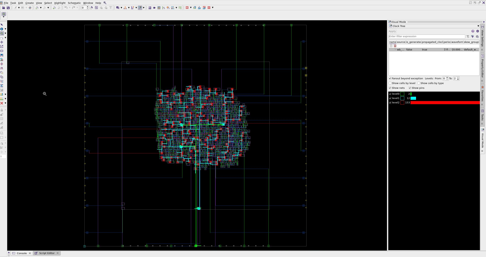
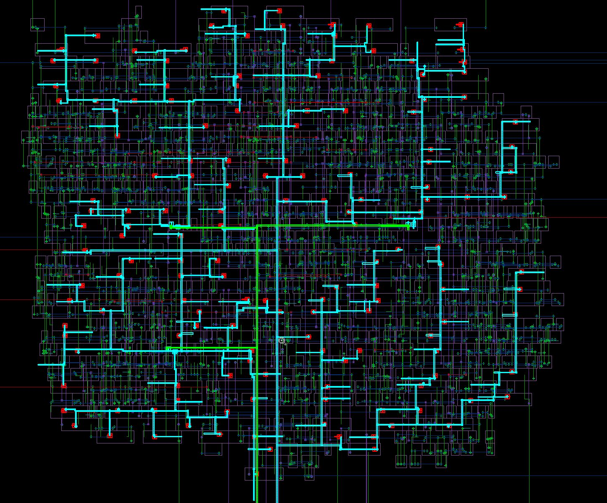
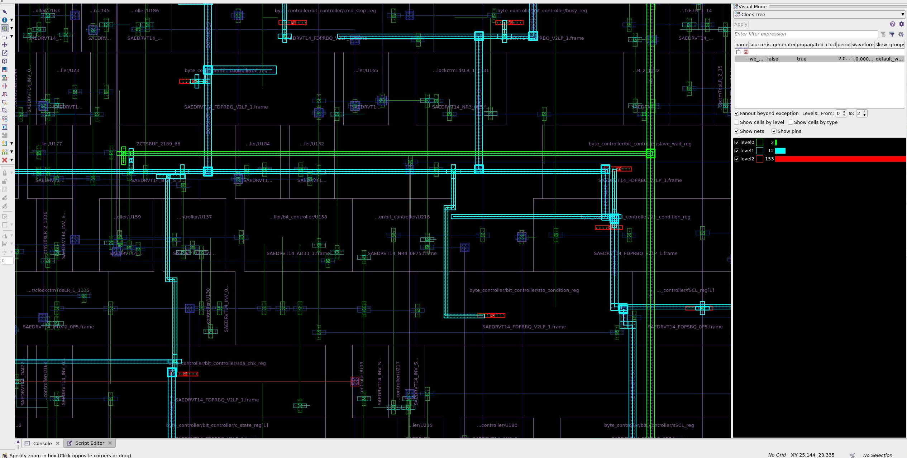

### 10. Clock tree synthesis optimization reports

```tcl
# Generates a report that includes various QoR metrics related to the clock tree,
# such as timing, area, and power.
report_clock_qor > reports/clock_tree.rpt

# Generates a report focused on clock skew timing, which is the difference in
# arrival times of the clock signal at different points in the circuit.
report_clock_timing -type skew > reports/clock_timing.rpt

# Those commands generate reports of the QoR
create_qor_snapshot -name clock -significant_digits 4
report_qor_snapshot -name clock > reports/clock.qor_snapshot.rpt
report_qor > reports/clock.qor

# Those commands generate reports of all constraint violations, delay characteristics.
report_constraints -all_violators > reports/clock_route.con
report_timing -capacitance -transition_time -input_pins -nets -delay_type max > reports/clock.max.tim
report_timing -capacitance -transition_time -input_pins -nets -delay_type min > reports/clock.min.tim
```

#### Report Overview: `clock_timing.rpt`

**Report Breakdown**

1.  General Information

```
****************************************
Report : clock timing
        -type skew
        -nworst 1
        -setup
Design : i2c_master_top
Version: U-2022.12
Date   : Tue Oct  8 14:35:45 2024
****************************************
```

- **Type**: The report type is **skew**, which refers to the difference in arrival times of the clock signal at different points in the circuit.
- **Nworst**: The report is configured to show the **1 worst** skew instance, meaning it will highlight the single most significant skew issue.
- **Setup**: Indicates that the report is related to setup timing analysis.

2.  Clock and Mode Information

```
  Mode: func
  Clock: wb_clk_i
```

- **Clock**: The clock signal being analyzed is `wb_clk_i`, which is the primary clock for the design.

3.  Clock Pin Timing Details

```
  Clock Pin                                          Latency      Skew             Corner
---------------------------------------------------------------------------------------------------
  txr_reg_7_/CK                                         0.03              rp-+       slow
  byte_controller/sr_reg[7]/CK                          0.02      0.00    rp-+       slow
```

- **Clock Pin**: This section lists the clock pins being analyzed along with their associated timing metrics.
- **Latency**: The time delay from the clock source to the clock pin. For example:
  - `txr_reg_7_/CK` has a latency of **0.03 ns**.
  - `byte_controller/sr_reg[7]/CK` has a latency of **0.02 ns**.
- **Skew**: The difference in arrival times of the clock signal at different points. In this report:
  - `txr_reg_7_/CK` has a skew value of **rp-+**, which indicates a specific skew condition (the exact meaning of `rp-+` would depend on the design context and tool documentation).
  - `byte_controller/sr_reg[7]/CK` has a skew of **0.00 ns**, indicating that this clock pin is perfectly aligned with the clock source.
- **Corner**: Indicates the operating condition under which the timing was analyzed. In this case, both clock pins are analyzed under the **slow** corner, which typically represents the worst-case scenario for timing.

#### Report Overview: `clock_tree.rpt`

This report focuses on various attributes of the clock tree, including latency, skew, and the number of sinks and repeaters. Below is a breakdown of the report's sections and their significance.

**Report Breakdown**

1.  General Information

```
 Info: Initializing timer in CLOCK_SYN_REPORT_MODE
Information: The value of option cts.compile.enable_cell_relocation has been overridden to "leaf_only" to support latency-driven placement. (CTS-973)
****************************************
Report : clock qor
        -type summary
Design : i2c_master_top
Version: U-2022.12
Date   : Tue Oct  8 14:35:40 2024
****************************************
```

- **Initialization Info**: Indicates that the timer is being initialized in **CLOCK_SYN_REPORT_MODE**, which is relevant for clock synthesis reporting.
- **Option Override**: The report notes that the option `cts.compile.enable_cell_relocation` has been set to **"leaf_only"** to support latency-driven placement, which is important for optimizing the clock tree.
- **Report Title**: Indicates that this is a clock QoR report.
- **Type**: The report type is **summary**, providing an overview of the clock network's performance.
- **Design Name**: The design being analyzed is `i2c_master_top`.
- **Version**: The version of the tool used to generate the report is **U-2022.12**.
- **Date and Time**: The report was generated on **Tue Oct 8, 2024**.

2.  Attributes

```
Attributes
===========
M Master Clock
G Generated Clock
& Internal Generated Clock
U User Defined Skew Group
D Default Skew Group
* Generated Clock Balanced Separately
```

3.  Summary Reporting for Corner Fast

```
===========================================
==== Summary Reporting for Corner fast ====
===========================================

============================================================ Summary Table for Corner fast =============================================================
Clock /                               Attrs     Sinks Levels    Clock     Clock     Clock       Max    Global  Trans DRC  Cap DRC      Wire
Skew Group                                                   Repeater  Repeater   Stdcell   Latency      Skew     Count     Count    Length
                                                                Count      Area      Area
--------------------------------------------------------------------------------------------------------------------------------------------------------
### Mode: func, Scenario: func_fast
wb_clk_i                                M,D       153      2        4      1.64      1.64      0.03      0.00         0         0    413.98
--------------------------------------------------------------------------------------------------------------------------------------------------------
All Clocks                                        153      2        4      1.64      1.64      0.03      0.00         0         0    413.98
```

- **Mode**: The analysis is performed in **func** mode.
- **Scenario**: The scenario is labeled as **func_fast**, indicating that it is a functional timing analysis under fast conditions.
- **Summary Table**: This table provides key metrics for the clock `wb_clk_i`:
  - **Clock**: The clock signal being analyzed is `wb_clk_i`.
  - **Attrs**: Attributes of the clock, marked as **M** (Master) and **D** (Default Skew Group).
  - **Sinks**: The number of sinks driven by the clock is **153**.
  - **Levels**: The number of levels in the clock tree is **2**.
  - **Clock Repeater Count**: The number of clock repeaters is **4**.
  - **Latency**: The total clock latency is **1.64 ns**.
  - **Skew**: The maximum skew is **1.64 ns**.
  - **Global Count**: The global clock count is **0**.
  - **Trans DRC**: The number of transition design rule check violations is **0**.
  - **Cap DRC**: The number of capacitance design rule check violations is **0**.
  - **Wire Length**: The total wire length for the clock tree is **413.98**.

4.  Summary Reporting for Corner Slow

```
===========================================
==== Summary Reporting for Corner slow ====
===========================================

============================================================ Summary Table for Corner slow =============================================================
Clock /                               Attrs     Sinks Levels    Clock     Clock     Clock       Max    Global  Trans DRC  Cap DRC      Wire
Skew Group                                                   Repeater  Repeater   Stdcell   Latency      Skew     Count     Count    Length
                                                                Count      Area      Area
--------------------------------------------------------------------------------------------------------------------------------------------------------
### Mode: func, Scenario: func_slow
wb_clk_i                                M,D       153      2        4      1.64      1.64      0.03      0.00         0         0    413.98
--------------------------------------------------------------------------------------------------------------------------------------------------------
All Clocks                                        153      2        4      1.64      1.64      0.03      0.00         0         0    413.98
```

- **Mode**: The analysis is again performed in **func** mode.
- **Scenario**: The scenario is labeled as **func_slow**, indicating that it is a functional timing analysis under slow conditions.
- **Summary Table**: Similar metrics are provided for the clock `wb_clk_i`:
  - The values for sinks, levels, repeaters, latency, skew, and wire length remain the same as in the fast corner analysis, indicating consistent performance across different operating conditions.

#### What is `clock repeater`

In the context of digital design and clock distribution networks, a **clock repeater** is a specialized circuit element used to enhance the performance of clock signals as they propagate through a design. Here’s a detailed explanation of what a clock repeater is, its purpose, and its significance:

**Definition of Clock Repeater**
A **clock repeater** is a buffer or amplifier specifically designed to regenerate and distribute clock signals within a digital circuit. It takes an incoming clock signal and produces a new clock signal that is a replica of the original, but with improved signal integrity.

**Purpose of Clock Repeaters**

1. **Signal Integrity**: As clock signals travel through a circuit, they can experience degradation due to factors such as capacitance, resistance, and inductance in the interconnects. Clock repeaters help restore the signal to its original shape, reducing the effects of noise and distortion.

2. **Skew Reduction**: Clock skew refers to the difference in arrival times of the clock signal at different components in the circuit. By strategically placing clock repeaters, designers can minimize skew, ensuring that all parts of the circuit receive the clock signal simultaneously.

3. **Drive Capability**: Clock repeaters increase the drive strength of the clock signal, allowing it to drive multiple loads (such as flip-flops and other sequential elements) without significant degradation in signal quality.

4. **Distance Coverage**: In large designs, the distance between the clock source and the clock sinks can be significant. Clock repeaters can be placed along the clock distribution path to ensure that the clock signal reaches all components effectively, even over long distances.

**Characteristics of Clock Repeaters**

- **Latency**: Clock repeaters introduce a small amount of latency, which is the time it takes for the clock signal to pass through the repeater. This latency must be accounted for in timing analysis.
- **Power Consumption**: While clock repeaters improve signal integrity, they also consume power. Designers must balance the benefits of using repeaters with the additional power they require.
- **Placement**: The placement of clock repeaters is critical. They should be positioned to optimize the clock distribution network, minimizing skew and ensuring that the clock signal reaches all components within the required timing constraints.

#### Report Overview: `clock.qor_snapshot.rpt`

```
***********************************************
Report          : create_qor_snapshot (clock)
Design          : i2c_master_top
Version         : U-2022.12
Date            : Tue Oct  8 14:35:55 2024
Time unit       : 1.00ns
Resistance unit : 1.00MOhm
Capacitance unit: 1.00fF
Voltage unit    : 1.00V
Current unit    : 1.00uA
Power unit      : 1.00pW
Location        : ***/m3/lab04/pnr/./
***********************************************
No. of scenario = 2
s1 = func_fast
s2 = func_slow
------------------------------------------------------------------------
WNS of each timing group:                       s1        s2
------------------------------------------------------------------------
wb_clk_i                                    1.3895    1.3737
------------------------------------------------------------------------
Setup WNS:                                  1.3895    1.3737      1.3737
Setup TNS:                                  0.0000    0.0000      0.0000
Number of setup violations:                      0         0           0
Hold WNS:                                   0.0252    0.0257      0.0252
Hold TNS:                                   0.0000    0.0000      0.0000
Number of hold violations:                       0         0           0
Number of max trans violations:                  0         0           0
Number of max cap violations:                    0         0           0
Number of min pulse width violations:            0         0           0
------------------------------------------------------------------------
Area:                                                            324.786
Cell count:                                                          705
Buf/inv cell count:                                                  144
Std cell utilization:                                             0.2008
CPU(s):                                                             9357
Mem(Mb):                                                            1810
Host name:                                                          ****
------------------------------------------------------------------------
Histogram:             s1   s2
------------------------------------------------------------------------
Max violations:         0    0
   above ~ -0.7  ---    0    0
    -0.6 ~ -0.7  ---    0    0
    -0.5 ~ -0.6  ---    0    0
    -0.4 ~ -0.5  ---    0    0
    -0.3 ~ -0.4  ---    0    0
    -0.2 ~ -0.3  ---    0    0
    -0.1 ~ -0.2  ---    0    0
       0 ~ -0.1  ---    0    0
------------------------------------------------------------------------
Min violations:         0    0
  -0.06 ~ above  ---    0    0
  -0.05 ~ -0.06  ---    0    0
  -0.04 ~ -0.05  ---    0    0
  -0.03 ~ -0.04  ---    0    0
  -0.02 ~ -0.03  ---    0    0
  -0.01 ~ -0.02  ---    0    0
      0 ~ -0.01  ---    0    0
------------------------------------------------------------------------
Snapshot report (index) is created and can be viewed using file "***/m3/lab04/pnr/.//index.html"
```

_**Note**: See [place.qor_snapshot.rpt](#report-overview-placeqor_snapshotrpt) to understand this report_

#### Report Overview: `clock.qor`

```
****************************************
Report : qor
Design : i2c_master_top
Version: U-2022.12
Date   : Tue Oct  8 14:35:58 2024
****************************************


Scenario           'func_fast'
Timing Path Group  'wb_clk_i'
----------------------------------------
Levels of Logic:                      9
Critical Path Length:              0.31
Critical Path Slack:               1.39
Critical Path Clk Period:          2.00
Total Negative Slack:              0.00
No. of Violating Paths:               0
Worst Hold Violation:              0.00
Total Hold Violation:              0.00
No. of Hold Violations:               0
----------------------------------------

Scenario           'func_slow'
Timing Path Group  'wb_clk_i'
----------------------------------------
Levels of Logic:                      9
Critical Path Length:              0.32
Critical Path Slack:               1.37
Critical Path Clk Period:          2.00
Total Negative Slack:              0.00
No. of Violating Paths:               0
Worst Hold Violation:              0.00
Total Hold Violation:              0.00
No. of Hold Violations:               0
----------------------------------------


Cell Count
----------------------------------------
Hierarchical Cell Count:              4
Hierarchical Port Count:            171
Leaf Cell Count:                    705
Buf/Inv Cell Count:                 144
Buf Cell Count:                       7
Inv Cell Count:                     137
CT Buf/Inv Cell Count:                0
Combinational Cell Count:           552
   Single-bit Isolation Cell Count:                        0
   Multi-bit Isolation Cell Count:                         0
   Isolation Cell Banking Ratio:                           0.00%
   Single-bit Level Shifter Cell Count:                    0
   Multi-bit Level Shifter Cell Count:                     0
   Level Shifter Cell Banking Ratio:                       0.00%
   Single-bit ELS Cell Count:                              0
   Multi-bit ELS Cell Count:                               0
   ELS Cell Banking Ratio:                                 0.00%
Sequential Cell Count:              153
   Integrated Clock-Gating Cell Count:                     0
   Sequential Macro Cell Count:                            0
   Single-bit Sequential Cell Count:                       153
   Multi-bit Sequential Cell Count:                        0
   Sequential Cell Banking Ratio:                          0.00%
   BitsPerflop:                                            1.00
Macro Count:                          0
----------------------------------------


Area
----------------------------------------
Combinational Area:              161.79
Noncombinational Area:           162.99
Buf/Inv Area:                     26.82
Total Buffer Area:                 2.49
Total Inverter Area:              24.33
Macro/Black Box Area:              0.00
Net Area:                             0
Net XLength:                    2728.11
Net YLength:                    2789.04
----------------------------------------
Cell Area (netlist):                            324.79
Cell Area (netlist and physical only):          324.79
Net Length:                     5517.15


Design Rules
----------------------------------------
Total Number of Nets:               727
Nets with Violations:                 0
Max Trans Violations:                 0
Max Cap Violations:                   0
----------------------------------------

1
```

_**Note**: See [place.qor](#report-overview-placeqor) to understand this report_

#### Report Overview: `clock_route.con`

```
****************************************
Report : constraint
        -all_violators
Design : i2c_master_top
Version: U-2022.12
Date   : Tue Oct  8 14:36:04 2024
****************************************

   late_timing
   -----------

Endpoint                         Path Delay     Path Required       CRP    Slack Group    Scenario
----------------------------------------------------------------------------------------------------------
No paths.

   early_timing
   -----------

Endpoint                         Path Delay     Path Required       CRP    Slack Group    Scenario
----------------------------------------------------------------------------------------------------------
No paths.

   Mode: func Corner: slow
   Scenario: func_slow
  ---------------------------------------------------------------------------
   Number of max_transition violation(s): 0

   Mode: func Corner: slow
   Scenario: func_slow
  ---------------------------------------------------------------------------
   Number of max_capacitance violation(s): 0


   Mode: func Corner: slow
   Scenario: func_slow
  ---------------------------------------------------------------------------
   Number of min_capacitance violation(s): 0

  Mode: func
  Corner: slow
  Scenario: func_slow

  ---------------------------------------------------------------------------
   Number of min_pulse_width violation(s): 0
   Total number of violation(s): 0
1
```

#### Report Overview: `clock.max.tim`

```
****************************************
Report : timing
        -path_type full
        -delay_type max
        -max_paths 1
        -report_by design
        -input_pins
        -nets
        -transition_time
        -capacitance
Design : i2c_master_top
Version: U-2022.12
Date   : Tue Oct  8 14:36:04 2024
****************************************

  Startpoint: byte_controller/bit_controller/cnt_reg[3] (rising edge-triggered flip-flop clocked by wb_clk_i)
  Endpoint: byte_controller/bit_controller/cnt_reg[1] (rising edge-triggered flip-flop clocked by wb_clk_i)
  Mode: func
  Corner: slow
  Scenario: func_slow
  Path Group: wb_clk_i
  Path Type: max

  Point                                          Fanout    Cap      Trans      Incr      Path
  ----------------------------------------------------------------------------------------------------
  clock wb_clk_i (rise edge)                                                   0.00      0.00
  clock network delay (propagated)                                             0.03      0.03

  byte_controller/bit_controller/cnt_reg[3]/CK (SAEDRVT14_FDPRBQ_V2LP_0P5)
                                                                     0.02      0.00      0.03 r
  ...
  ...
  byte_controller/bit_controller/cnt_reg[1]/D (SAEDRVT14_FDPRBQ_V2LP_0P5)
                                                                     0.01      0.00      0.35 f
  data arrival time                                                                      0.35

  clock wb_clk_i (rise edge)                                                   2.00      2.00
  clock network delay (propagated)                                             0.03      2.03
  byte_controller/bit_controller/cnt_reg[1]/CK (SAEDRVT14_FDPRBQ_V2LP_0P5)
                                                                     0.02      0.00      2.03 r
  clock uncertainty                                                           -0.30      1.73
  library setup time                                                          -0.00      1.73
  data required time                                                                     1.73
  ----------------------------------------------------------------------------------------------------
  data required time                                                                     1.73
  data arrival time                                                                     -0.35
  ----------------------------------------------------------------------------------------------------
  slack (MET)                                                                            1.37


1
```

_**Note**: See [place.max.tim](#report-overview-placemaxtim) to understand this report_

#### Report Overview: `clock.min.tim`

```
****************************************
Report : timing
        -path_type full
        -delay_type min
        -max_paths 1
        -report_by design
        -input_pins
        -nets
        -transition_time
        -capacitance
Design : i2c_master_top
Version: U-2022.12
Date   : Tue Oct  8 14:36:06 2024
****************************************

  Startpoint: wb_ack_o_reg (rising edge-triggered flip-flop clocked by wb_clk_i)
  Endpoint: wb_ack_o_reg (rising edge-triggered flip-flop clocked by wb_clk_i)
  Mode: func
  Corner: fast
  Scenario: func_fast
  Path Group: wb_clk_i
  Path Type: min

  Point                                          Fanout    Cap      Trans      Incr      Path
  ----------------------------------------------------------------------------------------------------
  clock wb_clk_i (rise edge)                                                   0.00      0.00
  clock network delay (propagated)                                             0.02      0.02

  wb_ack_o_reg/CK (SAEDRVT14_FDP_V2LP_1)                             0.02      0.00      0.02 r
  ...
  ...
  wb_ack_o_reg/D (SAEDRVT14_FDP_V2LP_1)                              0.00      0.00      0.05 f
  data arrival time                                                                      0.05

  clock wb_clk_i (rise edge)                                                   0.00      0.00
  clock network delay (propagated)                                             0.02      0.02
  wb_ack_o_reg/CK (SAEDRVT14_FDP_V2LP_1)                             0.02      0.00      0.02 r
  library hold time                                                            0.01      0.03
  data required time                                                                     0.03
  ----------------------------------------------------------------------------------------------------
  data required time                                                                     0.03
  data arrival time                                                                     -0.05
  ----------------------------------------------------------------------------------------------------
  slack (MET)                                                                            0.03


1
```

_**Note**: See [place.min.tim](#report-overview-placemintim) to understand this report_

### 11. Routing

```tcl
# This command checks whether the current design can be routed successfully given the existing layout
# and design constraints.
check_routability

# Ignore layer M2 to layer M6 during the routing process.
set_ignored_layers -min_routing_layer M2 -max_routing_layer M6

# This command generates a report detailing the layers that have been set to be ignored
# during the routing process.
report_ignored_layers


# This command performs optimization on the routing of the design. It adjusts the existing routing
# to improve performance metrics such as timing, area, and power consumption.
# This may involve rerouting certain paths, adjusting wire widths, or modifying the placement of components.
route_opt
```

#### Report log overview: `check_routability`

Based on the log, the Design can be routed successfully.

TODO: Fix warnings: `Port VDD and VSS is unplaced`

#### Report overview: `ignored_layers`

```
****************************************
Report : Ignored Layers
Design : i2c_master_top
Version: U-2022.12
Date   : Tue Oct  8 16:37:04 2024
****************************************
Layer Attribute                 Value
--------------------------------------------------------------------------------
Min Routing Layer               M2
Max Routing Layer               M5
RC Estimation Ignored Layers    PO M1 M6 M7 M8 M9 MRDL
1
```

#### Design view after route

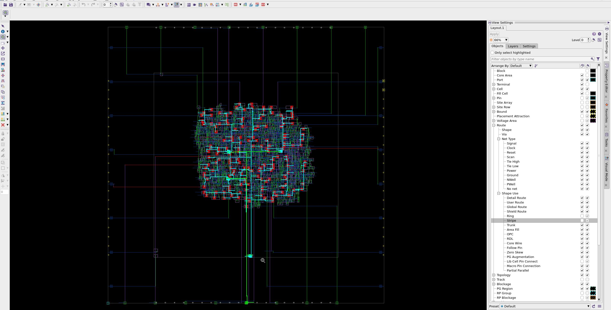
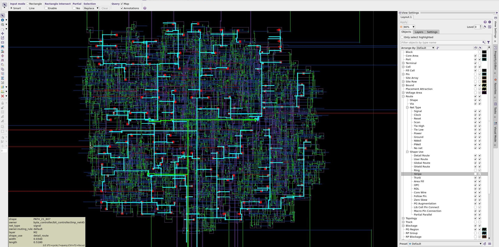

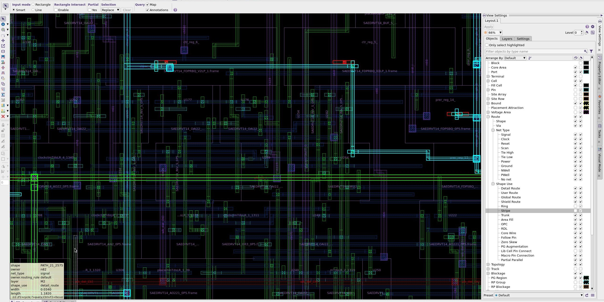

### 12. Routing optimization

```tcl
# This command connects the power net (VDD) to all relevant pins in the design
# that are designated as VDD pins.
#     [get_pins -physical_context */VDD]: This part of the command retrieves all pins in the design
#     that are associated with the VDD net. The -physical_context option ensures that only physical pins
#     are considered, which is important for accurate routing.
connect_pg_net -net VDD [get_pins -physical_context */VDD]

# Similar to the previous command, this command connects the ground net (VSS) to all relevant pins
# in the design that are designated as VSS pins.
connect_pg_net -net VSS [get_pins -physical_context */VSS]

# This command optimizes the routing of the design to improve performance metrics
# such as timing, area, and power consumption.
#     -max_detail_route_iterations 5: This option specifies the maximum number
#     of detailed routing iterations to perform during the optimization process.
#     In this case, it is set to 5 iterations.
optimize_routes -max_detail_route_iterations 5
```

#### Design view after route optimization

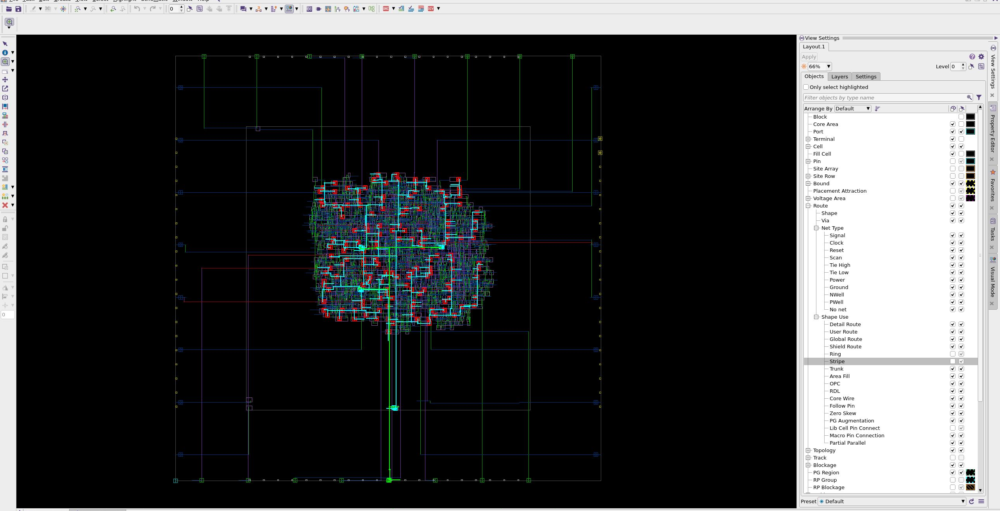
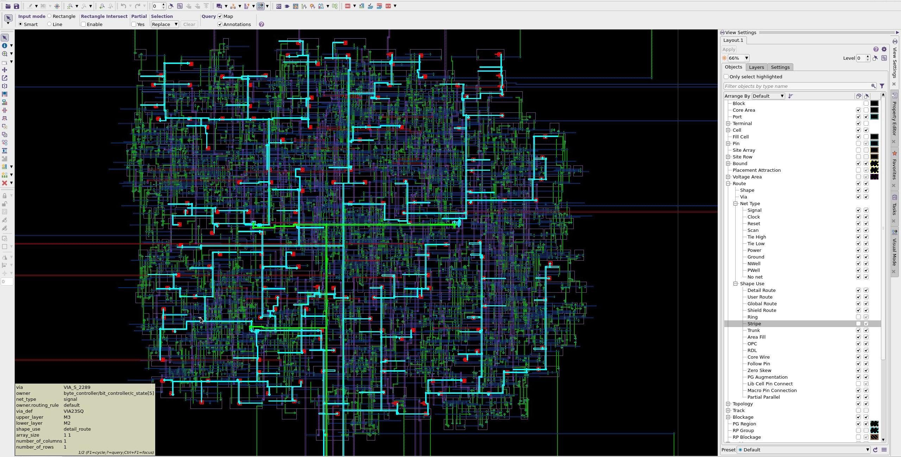

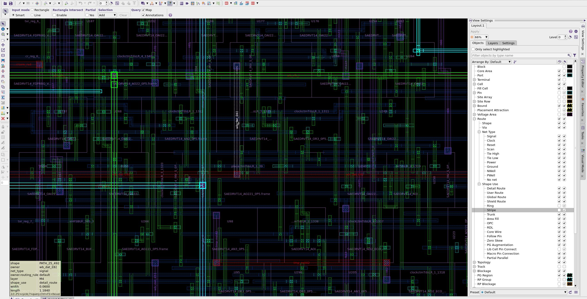

### 13. Checking for problems and reports

#### Check layout-versus-schematic to see if there is any problem after the routing

```tcl
check_lvs -max_errors 2000
```

#### The log overview: `check_lvs`

```
===============================================================
    Maximum number of violations is set to 2000
    Abort checking when more than 2000 violations are found
    All violations might not be found.
===============================================================
Total number of input nets is 727.
Total number of short violations is 522.
Total number of open nets is 0.
Total number of floating route violations is 0.

Elapsed =    0:00:01, CPU =    0:00:01
1
```

#### Create the final report

```tcl
set_app_option -name time.snapshot_storage_location -value "./"
create_qor_snapshot -name route -significant_digits 4

# This command generates a report on the routing congestion in the design.
report_congestion

# This command generates a Verilog netlist of the routed design. It includes the power and ground netlist
# in the output.
write_verilog -include {pg_netlist} "${DESIGN_NAME}_routed.v"


report_qor_snapshot -name route > reports/route.qor_snapshot.rpt
report_qor > reports/route.qor
report_constraints -all_violators > reports/route.con
report_timing -capacitance -transition_time -input_pins -nets -delay_type max > reports/route.max.tim
report_timing -capacitance -transition_time -input_pins -nets -delay_type min > reports/route.min.tim
```

#### Report Overview: `report_congestion`

```
****************************************
Report : congestion
Design : i2c_master_top
Version: U-2022.12
Date   : Tue Oct  8 17:56:37 2024
****************************************

Layer     |    overflow     |              # GRCs has
Name      |  total  |  max  | overflow (%)      | max overflow
---------------------------------------------------------------
Both Dirs |      60 |     3 |      42  ( 0.21%) |       3
H routing |       3 |     2 |       2  ( 0.02%) |       1
V routing |      57 |     3 |      40  ( 0.39%) |       3

1
```

#### Report Overview: `route.qor_snapshot.rpt`

```


***********************************************
Report          : create_qor_snapshot (route)
Design          : i2c_master_top
Version         : U-2022.12
Date            : Tue Oct  8 17:56:27 2024
Time unit       : 1.00ns
Resistance unit : 1.00MOhm
Capacitance unit: 1.00fF
Voltage unit    : 1.00V
Current unit    : 1.00uA
Power unit      : 1.00pW
Location        : ***/m3/lab04/pnr/./
***********************************************
No. of scenario = 2
s1 = func_fast
s2 = func_slow
------------------------------------------------------------------------
WNS of each timing group:                       s1        s2
------------------------------------------------------------------------
wb_clk_i                                    1.4002    1.3821
------------------------------------------------------------------------
Setup WNS:                                  1.4002    1.3821      1.3821
Setup TNS:                                  0.0000    0.0000      0.0000
Number of setup violations:                      0         0           0
Hold WNS:                                   0.0242    0.0246      0.0242
Hold TNS:                                   0.0000    0.0000      0.0000
Number of hold violations:                       0         0           0
Number of max trans violations:                  0         0           0
Number of max cap violations:                    0         0           0
Number of min pulse width violations:            0         0           0
------------------------------------------------------------------------
Area:                                                            324.875
Cell count:                                                          705
Buf/inv cell count:                                                  144
Std cell utilization:                                             0.2008
CPU(s):                                                            11090
Mem(Mb):                                                            1810
Host name:                                                          ****
------------------------------------------------------------------------
Histogram:             s1   s2
------------------------------------------------------------------------
Max violations:         0    0
   above ~ -0.7  ---    0    0
    -0.6 ~ -0.7  ---    0    0
    -0.5 ~ -0.6  ---    0    0
    -0.4 ~ -0.5  ---    0    0
    -0.3 ~ -0.4  ---    0    0
    -0.2 ~ -0.3  ---    0    0
    -0.1 ~ -0.2  ---    0    0
       0 ~ -0.1  ---    0    0
------------------------------------------------------------------------
Min violations:         0    0
  -0.06 ~ above  ---    0    0
  -0.05 ~ -0.06  ---    0    0
  -0.04 ~ -0.05  ---    0    0
  -0.03 ~ -0.04  ---    0    0
  -0.02 ~ -0.03  ---    0    0
  -0.01 ~ -0.02  ---    0    0
      0 ~ -0.01  ---    0    0
------------------------------------------------------------------------
Snapshot report (index) is created and can be viewed using file "***/m3/lab04/pnr/.//index.html"
true
```

_**Note**: See [place.qor_snapshot.rpt](#report-overview-placeqor_snapshotrpt) to understand this report_

#### Report Overview: `route.qor`

```
****************************************
Report : qor
Design : i2c_master_top
Version: U-2022.12
Date   : Tue Oct  8 17:59:30 2024
****************************************


Scenario           'func_fast'
Timing Path Group  'wb_clk_i'
----------------------------------------
Levels of Logic:                      9
Critical Path Length:              0.30
Critical Path Slack:               1.40
Critical Path Clk Period:          2.00
Total Negative Slack:              0.00
No. of Violating Paths:               0
Worst Hold Violation:              0.00
Total Hold Violation:              0.00
No. of Hold Violations:               0
----------------------------------------

Scenario           'func_slow'
Timing Path Group  'wb_clk_i'
----------------------------------------
Levels of Logic:                      9
Critical Path Length:              0.32
Critical Path Slack:               1.38
Critical Path Clk Period:          2.00
Total Negative Slack:              0.00
No. of Violating Paths:               0
Worst Hold Violation:              0.00
Total Hold Violation:              0.00
No. of Hold Violations:               0
----------------------------------------


Cell Count
----------------------------------------
Hierarchical Cell Count:              4
Hierarchical Port Count:            171
Leaf Cell Count:                    705
Buf/Inv Cell Count:                 144
Buf Cell Count:                       7
Inv Cell Count:                     137
CT Buf/Inv Cell Count:                0
Combinational Cell Count:           552
   Single-bit Isolation Cell Count:                        0
   Multi-bit Isolation Cell Count:                         0
   Isolation Cell Banking Ratio:                           0.00%
   Single-bit Level Shifter Cell Count:                    0
   Multi-bit Level Shifter Cell Count:                     0
   Level Shifter Cell Banking Ratio:                       0.00%
   Single-bit ELS Cell Count:                              0
   Multi-bit ELS Cell Count:                               0
   ELS Cell Banking Ratio:                                 0.00%
Sequential Cell Count:              153
   Integrated Clock-Gating Cell Count:                     0
   Sequential Macro Cell Count:                            0
   Single-bit Sequential Cell Count:                       153
   Multi-bit Sequential Cell Count:                        0
   Sequential Cell Banking Ratio:                          0.00%
   BitsPerflop:                                            1.00
Macro Count:                          0
----------------------------------------


Area
----------------------------------------
Combinational Area:              161.88
Noncombinational Area:           162.99
Buf/Inv Area:                     26.82
Total Buffer Area:                 2.49
Total Inverter Area:              24.33
Macro/Black Box Area:              0.00
Net Area:                             0
Net XLength:                    3403.64
Net YLength:                    2801.31
----------------------------------------
Cell Area (netlist):                            324.87
Cell Area (netlist and physical only):          324.88
Net Length:                     6204.95


Design Rules
----------------------------------------
Total Number of Nets:               727
Nets with Violations:                 0
Max Trans Violations:                 0
Max Cap Violations:                   0
----------------------------------------

1
```

_**Note**: See [place.qor](#report-overview-placeqor) to understand this report_

#### Report Overview: `route.con`

```
****************************************
Report : constraint
        -all_violators
Design : i2c_master_top
Version: U-2022.12
Date   : Tue Oct  8 17:59:44 2024
****************************************

   late_timing
   -----------

Endpoint                         Path Delay     Path Required       CRP    Slack Group    Scenario
----------------------------------------------------------------------------------------------------------
No paths.

   early_timing
   -----------

Endpoint                         Path Delay     Path Required       CRP    Slack Group    Scenario
----------------------------------------------------------------------------------------------------------
No paths.

   Mode: func Corner: slow
   Scenario: func_slow
  ---------------------------------------------------------------------------
   Number of max_transition violation(s): 0

   Mode: func Corner: slow
   Scenario: func_slow
  ---------------------------------------------------------------------------
   Number of max_capacitance violation(s): 0


   Mode: func Corner: slow
   Scenario: func_slow
  ---------------------------------------------------------------------------
   Number of min_capacitance violation(s): 0

  Mode: func
  Corner: slow
  Scenario: func_slow

  ---------------------------------------------------------------------------
   Number of min_pulse_width violation(s): 0
   Total number of violation(s): 0
1

```

#### Report Overview: `clock.max.tim`

```
****************************************
Report : timing
        -path_type full
        -delay_type max
        -max_paths 1
        -report_by design
        -input_pins
        -nets
        -transition_time
        -capacitance
Design : i2c_master_top
Version: U-2022.12
Date   : Tue Oct  8 17:59:53 2024
****************************************

  Startpoint: byte_controller/bit_controller/cnt_reg[2] (rising edge-triggered flip-flop clocked by wb_clk_i)
  Endpoint: byte_controller/bit_controller/cnt_reg[1] (rising edge-triggered flip-flop clocked by wb_clk_i)
  Mode: func
  Corner: slow
  Scenario: func_slow
  Path Group: wb_clk_i
  Path Type: max

  Point                                          Fanout    Cap      Trans      Incr      Path
  ----------------------------------------------------------------------------------------------------
  clock wb_clk_i (rise edge)                                                   0.00      0.00
  clock network delay (propagated)                                             0.03      0.03

  byte_controller/bit_controller/cnt_reg[2]/CK (SAEDRVT14_FDPRBQ_V2LP_0P5)
                                                                     0.02      0.00      0.03 r
  byte_controller/bit_controller/cnt_reg[2]/Q (SAEDRVT14_FDPRBQ_V2LP_0P5)
                                                                     0.01      0.04      0.06 r
  ...
  ...

  byte_controller/bit_controller/cnt_reg[1]/D (SAEDRVT14_FDPRBQ_V2LP_0P5)
                                                                     0.01      0.00      0.34 f
  data arrival time                                                                      0.34

  clock wb_clk_i (rise edge)                                                   2.00      2.00
  clock network delay (propagated)                                             0.03      2.03
  byte_controller/bit_controller/cnt_reg[1]/CK (SAEDRVT14_FDPRBQ_V2LP_0P5)
                                                                     0.02      0.00      2.03 r
  clock uncertainty                                                           -0.30      1.73
  library setup time                                                          -0.00      1.72
  data required time                                                                     1.72
  ----------------------------------------------------------------------------------------------------
  data required time                                                                     1.72
  data arrival time                                                                     -0.34
  ----------------------------------------------------------------------------------------------------
  slack (MET)                                                                            1.38


1

```

_**Note**: See [place.max.tim](#report-overview-placemaxtim) to understand this report_

#### Report Overview: `clock.min.tim`

```
****************************************
Report : timing
        -path_type full
        -delay_type min
        -max_paths 1
        -report_by design
        -input_pins
        -nets
        -transition_time
        -capacitance
Design : i2c_master_top
Version: U-2022.12
Date   : Tue Oct  8 17:59:54 2024
****************************************

  Startpoint: wb_ack_o_reg (rising edge-triggered flip-flop clocked by wb_clk_i)
  Endpoint: wb_ack_o_reg (rising edge-triggered flip-flop clocked by wb_clk_i)
  Mode: func
  Corner: fast
  Scenario: func_fast
  Path Group: wb_clk_i
  Path Type: min

  Point                                          Fanout    Cap      Trans      Incr      Path
  ----------------------------------------------------------------------------------------------------
  clock wb_clk_i (rise edge)                                                   0.00      0.00
  clock network delay (propagated)                                             0.02      0.02

  ...
  ...

  clock wb_clk_i (rise edge)                                                   0.00      0.00
  clock network delay (propagated)                                             0.02      0.02
  wb_ack_o_reg/CK (SAEDRVT14_FDP_V2LP_1)                             0.02      0.00      0.02 r
  library hold time                                                            0.01      0.03
  data required time                                                                     0.03
  ----------------------------------------------------------------------------------------------------
  data required time                                                                     0.03
  data arrival time                                                                     -0.05
  ----------------------------------------------------------------------------------------------------
  slack (MET)                                                                            0.02


1

```

_**Note**: See [place.min.tim](#report-overview-placemintim) to understand this report_
