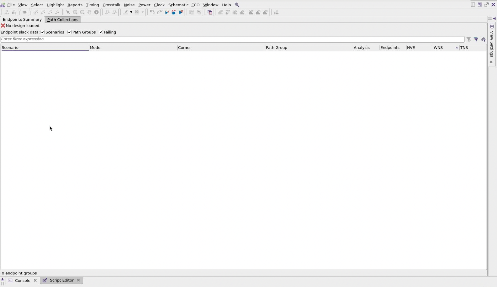

# Lab 5: Static Timing Analysis

## Practical part

### 1. Copy lab05 folder and move to the working directory lab05

### 2. Run the synthesis with the following command

```bash
cd $HOME/icdesign/m3/lab05/syn
dc_shell -f scripts/compile.tcl 2>&1 | tee run.log
```

#### Hold time violations

There are 151 hold time violations in `master_clk` path group

```
# reports/i2c_master_top_qor_reports.log

  Timing Path Group 'master_clk'
  -----------------------------------
  Levels of Logic:              16.00
  Critical Path Length:          0.34
  Critical Path Slack:           1.54
  Critical Path Clk Period:      2.00
  Total Negative Slack:          0.00
  No. of Violating Paths:        0.00
  Worst Hold Violation:         -0.07
  Total Hold Violation:         -7.00
  No. of Hold Violations:      151.00
  -----------------------------------
```

To fix these violations we just update timing constrains in the `inputs/i2c_master_top.sdc`.

```tcl
# Old clock uncertainty
set_clock_uncertainty 0.1 [get_clocks {master_clk}]

# New clock uncertainty
set_clock_uncertainty -setup 0.1 [get_clocks {master_clk}]
set_clock_uncertainty -hold 0.01 [get_clocks {master_clk}]
```

But we just keep these violations and move to the next step.

### 3. Run the floorplan, placement and route with the following command

```bash
cd $HOME/icdesign/m3/lab05/pnr
icc2_shell -f scripts/flow.tcl 2>&1 | tee run.log
```

Similar to previous step, we also have alot of hold time violations. We keep those violations and move to the next steps. Here is some report files:

```
# reports/clock_pre_route.qor

Scenario           'func_fast'
Timing Path Group  'master_clk'
----------------------------------------
Levels of Logic:                     16
Critical Path Length:              0.25
Critical Path Slack:               1.64
Critical Path Clk Period:          2.00
Total Negative Slack:              0.00
No. of Violating Paths:               0
Worst Hold Violation:             -0.08
Total Hold Violation:             -9.36
No. of Hold Violations:             151
----------------------------------------
```

```
# reports/clock.qor

Scenario           'func_fast'
Timing Path Group  'master_clk'
----------------------------------------
Levels of Logic:                      9
Critical Path Length:              0.35
Critical Path Slack:               1.54
Critical Path Clk Period:          2.00
Total Negative Slack:              0.00
No. of Violating Paths:               0
Worst Hold Violation:             -0.00
Total Hold Violation:             -0.00
No. of Hold Violations:               3
----------------------------------------
```

```
# reports/route.qor

Scenario           'func_fast'
Timing Path Group  'master_clk'
----------------------------------------
Levels of Logic:                     10
Critical Path Length:              0.31
Critical Path Slack:               1.58
Critical Path Clk Period:          2.00
Total Negative Slack:              0.00
No. of Violating Paths:               0
Worst Hold Violation:             -0.02
Total Hold Violation:             -0.87
No. of Hold Violations:             129
----------------------------------------
```

### 4. Open the cell after Place & Route and write out the necessary file

```bash
icc2_shell -gui
```

```tcl
# Re-open design
source ../common/common.tcl
open_lib $ARC_TOP
copy_block -from_block 11_${DESIGN_NAME}_route_finish -to 12_${DESIGN_NAME}_parasitic_start
open_block 12_${DESIGN_NAME}_parasitic_start

# This command generates a parasitic extraction file, which contains information about the parasitic capacitance, resistance, and inductance in the circuit.
#  -no_name_mapping: Indicates that the tool should not perform name mapping for the extracted elements, which can simplify the output file.
#  -compress: Enables compression of the output file to save space.
#  -hierarchical: Indicates that the extraction should consider the hierarchical structure of the design, which is important for complex designs.
#  -rde_corr: I don't known for now!
#  -format spef: Specifies the output format as SPEF (Standard Parasitic Exchange Format), which is a standard format for representing parasitic data.
#  -corner slow: Refers to the "slow" process corner.
write_parasitics -output ../results/i2c_master_top.max.spef -no_name_mapping -compress -hierarchical -rde_corr -format spef -corner slow

# Similar to the first one but generates a parasitic extraction file for the "minimum" corner (best-case scenario).
write_parasitics -output ../results/i2c_master_top.min.spef -no_name_mapping -compress -hierarchical -rde_corr -format spef -corner fast

# Exports the design in Verilog format
write_verilog ../results/i2c_master_top.pnr.v -include all
```



Five new files will be created:

- results/i2c_master_top.max.spef.i2c_master_top.spef_scenario
- results/i2c_master_top.max.spef.i2c_master_top.tlup_max_25.spef.gz
- results/i2c_master_top.min.spef.i2c_master_top.spef_scenario
- results/i2c_master_top.min.spef.i2c_master_top.tlup_min_25.spef.gz
- results/i2c_master_top.pnr.v

### 5. Start PrimeTime graphical user interface (GUI) from `sta` directory.

```bash
cd $HOME/icdesign/m3/lab05/sta
pt_shell -gui
```

")

### 6. The libraries are appended to the search path from .synopsys_pt.setup file located in `work` directory.

The setup file includes the following:

```tcl
source ../common/common.tcl
```

### 7. Setup the library

```tcl
set link_library "* saed14rvt_ss0p6v125c.db"
```

### 8. Read the design netlist.

PrimeTime accepts design gate-level netlists in Verilog and VHDL formats. Read design netlist with the following command: read_verilog, read_vhdl.

```tcl
read_verilog [list ../results/i2c_master_top.pnr.v]
current_design i2c_master_top
```

### 9. For a design to be complete, it needs to be connected to all of the library components and designs it references.

So to perform a name-based resolution of design references for the current design use the link command. The references must be located and linked to the current design in order for the design to be functional. The purpose of this command is to locate all of the designs and library components referenced in the current design and connect (link) them to the current design.

```tcl
link
```

### 10. Read the design constraints and parasitics.

```tcl
source -echo -verbose ../inputs/i2c_master_top_icc.sdc
read_parasitics ../results/i2c_master_top.max.spef
```

The `inputs/i2c_master_top_icc.sdc` file.

```tcl
# Set clock period to 2ns
set CLOCK_PERIOD 2
# Creates a clock named master_clk. The waveform is specified to start at 0 and go high for half the period. The clock is associated with the port wb_clk_i.
create_clock -name master_clk -period $CLOCK_PERIOD -waveform [list 0 [expr $CLOCK_PERIOD / 2.0]] wb_clk_i

# Sets the master_clk as a propagated clock, meaning that it will be used to derive timing information for downstream logic.
set_propagated_clock [get_clocks master_clk]

# Specifies the rise/fall transition time
set_clock_transition -rise 0.02 [get_clocks master_clk]
set_clock_transition -fall 0.02 [get_clocks master_clk]

# Filters the collection of clock sources to find those that are ports and assigns them to the variable ports_clock_root. This is used to identify which ports are driving the clock.
set ports_clock_root [filter_collection [get_attribute [get_clocks] sources] object_class==port]
# Creates a group path that includes all output ports. This is useful for defining timing paths for outputs.
group_path -name REGOUT -to [all_outputs]
# Creates a group path that includes all input ports except those that are clock ports. This helps in defining paths for inputs that are not clock-related.
group_path -name REGIN -from [remove_from_collection [all_inputs] ${ports_clock_root}]
# Creates a group path that includes paths from all input ports (excluding clock ports) to all output ports. This is typically used for feedthrough paths where inputs directly affect outputs.
group_path -name FEEDTHROUGH -from [remove_from_collection [all_inputs] ${ports_clock_root}] -to [all_outputs]

#  Specifies that there is a false path from the reset input port wb_rst_i. This means that timing analysis tools should ignore this path, as it does not affect the timing of the design.
set_false_path -from [list [get_ports wb_rst_i]]

# Creates a collection of input ports excluding the clock port wb_clk_i and assigns it to the variable input_ports_except_clk.
set input_ports_except_clk [remove_from_collection [all_inputs] wb_clk_i]
# Sets an input delay for the input ports (excluding the clock) based on the master_clk. The delay is set to one-fourth of the clock period, which is used for timing analysis.
set_input_delay -clock master_clk [expr $CLOCK_PERIOD / 4.0] $input_ports_except_clk
# Similar to the input delay, but it is set for output delay
set_output_delay -clock master_clk [expr $CLOCK_PERIOD / 4.0] [all_outputs]

# Specifies the driving cell for the clock port wb_clk_i, indicating that it is driven by a buffer cell (SAEDRVT14_BUF_10) at pin X. This helps in timing analysis by defining the characteristics of the driving source.
set_driving_cell -lib_cell SAEDRVT14_BUF_10 -pin X [get_ports wb_clk_i]
# Specifies the driving cell for the reset port wb_rst_i, indicating that it is driven by a flip-flop cell (SAEDRVT14_FDPRBQ_V2_0P5) at pin Q.
set_driving_cell -lib_cell SAEDRVT14_FDPRBQ_V2_0P5 -pin Q [get_ports wb_rst_i]
# Sets the load capacitance for all output ports to 0.0004 units. This is important for timing analysis as it affects the delay and performance of the outputs.
set_load -pin_load 0.0004 [all_outputs]

# Sets the maximum transition time for the current design to 0.5 time units. This is used to ensure that the design meets timing requirements by limiting how quickly signals can change.
set_max_transition 0.5 [current_design]
```

### 11. Get a detailed report on all constraint violations in the design

with `report_constraint -all_violators`.

```tcl
file mkdir reports
report_constraint -all_violators -significant_digits 4 > reports/i2c_master_top.max_constr.rpt
```

#### The `reports/i2c_master_top.max_constr.rpt` file

```
****************************************
Report : constraint
	-all_violators
	-path slack_only
Design : i2c_master_top
Version: U-2022.12-SP2
Date   : Wed Oct 30 17:19:36 2024
****************************************


   min_capacitance

                             Required        Actual
   Pin                      Capacitance    Capacitance       Slack
   -----------------------------------------------------------------
   wb_dat_o_reg_0_/QN         0.1500         0.0000        -0.1500  (VIOLATED)
   wb_dat_o_reg_1_/QN         0.1500         0.0000        -0.1500  (VIOLATED)
   wb_dat_o_reg_2_/QN         0.1500         0.0000        -0.1500  (VIOLATED)
   wb_dat_o_reg_3_/QN         0.1500         0.0000        -0.1500  (VIOLATED)
   wb_dat_o_reg_4_/QN         0.1500         0.0000        -0.1500  (VIOLATED)
   wb_dat_o_reg_5_/QN         0.1500         0.0000        -0.1500  (VIOLATED)
   wb_dat_o_reg_6_/QN         0.1500         0.0000        -0.1500  (VIOLATED)
   wb_dat_o_reg_7_/QN         0.1500         0.0000        -0.1500  (VIOLATED)
   wb_dat_o_reg_0_/Q          0.1500         0.0047        -0.1453  (VIOLATED)
   wb_dat_o_reg_1_/Q          0.1500         0.0047        -0.1453  (VIOLATED)
   wb_dat_o_reg_2_/Q          0.1500         0.0047        -0.1453  (VIOLATED)
   wb_dat_o_reg_3_/Q          0.1500         0.0047        -0.1453  (VIOLATED)
   wb_dat_o_reg_4_/Q          0.1500         0.0047        -0.1453  (VIOLATED)
   wb_dat_o_reg_5_/Q          0.1500         0.0047        -0.1453  (VIOLATED)
   wb_dat_o_reg_6_/Q          0.1500         0.0047        -0.1453  (VIOLATED)
   wb_dat_o_reg_7_/Q          0.1500         0.0047        -0.1453  (VIOLATED)
   wb_inta_o_reg/Q            0.1500         0.0047        -0.1453  (VIOLATED)


```

**Constraint Violations**

- **Violation Details**:

  - The report lists pins with their required and actual capacitance values, along with the slack (difference between required and actual values). A negative slack indicates a violation.

- **Pins with Violations**:
  - Each pin listed (e.g., `wb_dat_o_reg_0_/QN`, `wb_dat_o_reg_1_/QN`, etc.) has a required capacitance of 0.1500 units.
  - The actual capacitance for these pins is either 0.0000 or 0.0047 units, leading to negative slack values (e.g., -0.1500 or -0.1453), indicating that the capacitance requirement is not met.

### 12. The `report_timing` command is the most flexible and powerful PrimeTime analysis command.

The `-delay_type` option specifies the type of timing checks to report. Set the delay type to `max` for setup checks, `min` for hold checks.

```tcl
report_timing -delay_type max -nworst 40 -significant_digits 4 > reports/i2c_master_top.max_timing.rpt
```

#### The `reports/i2c_master_top.max_timing.rpt` file.

```
****************************************
Report : timing
	-path_type full
	-delay_type max
	-nworst 40
	-slack_lesser_than 0.0000
	-max_paths 40
	-sort_by slack
Design : i2c_master_top
Version: U-2022.12-SP2
Date   : Wed Oct 30 17:53:16 2024
****************************************

No paths with slack less than 0.0000.

1

```

### 13. Export the result.

The output file of PrimeTime is Standard Delay Format (.sdf) and it includes delay information, such as pin-to-pin cell delays and net delays, and timing checks, such as setup, hold, recovery, and removal times. In the script it was done using the following command:

```tcl
write_sdf ../results/i2c_master_top.max.sdf
```

### 14. Reset the design and run the process above again but now with the hold check

```
reset_design
set link_library "* saed14rvt_ff0p6v125c.db"
read_verilog [list ../results/i2c_master_top.pnr.v]
current_design i2c_master_top
link
source -echo -verbose ../inputs/i2c_master_top_icc.sdc
read_parasitics ../results/i2c_master_top.min.spef
report_constraint -all_violators -significant_digits 4 > reports/i2c_master_top.min_constr.rpt
report_timing -delay_type min -nworst 40 -significant_digits 4 > reports/i2c_master_top.min_timing.rpt
write_sdf ../results/i2c_master_top.max.sdf
```

#### The `reports/i2c_master_top.min_constr.rpt` file.

```
****************************************
Report : constraint
	-all_violators
	-path slack_only
Design : i2c_master_top
Version: U-2022.12-SP2
Date   : Wed Oct 30 17:41:09 2024
****************************************

   min_capacitance

                             Required        Actual
   Pin                      Capacitance    Capacitance       Slack
   -----------------------------------------------------------------
   wb_dat_o_reg_0_/QN         0.1500         0.0000        -0.1500  (VIOLATED)
   wb_dat_o_reg_1_/QN         0.1500         0.0000        -0.1500  (VIOLATED)
   wb_dat_o_reg_2_/QN         0.1500         0.0000        -0.1500  (VIOLATED)
   wb_dat_o_reg_3_/QN         0.1500         0.0000        -0.1500  (VIOLATED)
   wb_dat_o_reg_4_/QN         0.1500         0.0000        -0.1500  (VIOLATED)
   wb_dat_o_reg_5_/QN         0.1500         0.0000        -0.1500  (VIOLATED)
   wb_dat_o_reg_6_/QN         0.1500         0.0000        -0.1500  (VIOLATED)
   wb_dat_o_reg_7_/QN         0.1500         0.0000        -0.1500  (VIOLATED)
   wb_dat_o_reg_0_/Q          0.1500         0.0047        -0.1453  (VIOLATED)
   wb_dat_o_reg_1_/Q          0.1500         0.0047        -0.1453  (VIOLATED)
   wb_dat_o_reg_2_/Q          0.1500         0.0047        -0.1453  (VIOLATED)
   wb_dat_o_reg_3_/Q          0.1500         0.0047        -0.1453  (VIOLATED)
   wb_dat_o_reg_4_/Q          0.1500         0.0047        -0.1453  (VIOLATED)
   wb_dat_o_reg_5_/Q          0.1500         0.0047        -0.1453  (VIOLATED)
   wb_dat_o_reg_6_/Q          0.1500         0.0047        -0.1453  (VIOLATED)
   wb_dat_o_reg_7_/Q          0.1500         0.0047        -0.1453  (VIOLATED)
   wb_inta_o_reg/Q            0.1500         0.0047        -0.1453  (VIOLATED)


```

#### The `reports/i2c_master_top.min_constr.rpt` file.

```
****************************************
Report : timing
	-path_type full
	-delay_type min
	-nworst 40
	-slack_lesser_than 0.0000
	-max_paths 40
	-sort_by slack
Design : i2c_master_top
Version: U-2022.12-SP2
Date   : Wed Oct 30 17:43:18 2024
****************************************

No paths with slack less than 0.0000.

1

```

15. To exit PrimeTime write:

```tcl
exit
```
