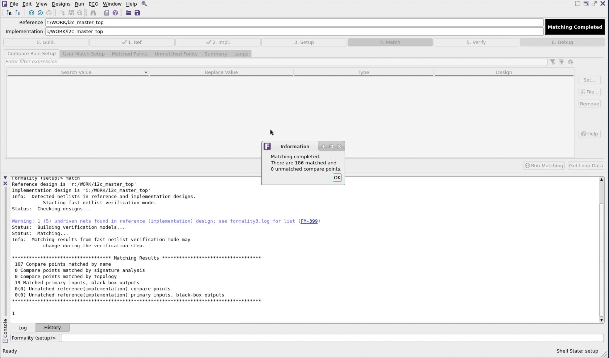

# What is Formal verification

Formal verification in integrated circuit (IC) design is a process used to ensure that a design behaves as intended by mathematically proving its correctness. Unlike traditional simulation-based verification, which tests a design against a set of test cases, formal verification uses mathematical models to prove the correctness of a design for all possible inputs and states.

### Key Aspects of Formal Verification:

1. **Mathematical Proofs**: Formal verification involves creating a mathematical model of the design and using logical reasoning to prove that the design meets its specifications.

2. **Exhaustive Coverage**: It provides exhaustive coverage of all possible scenarios, which is often not feasible with simulation due to the vast number of possible input combinations and states.

3. **Tools and Techniques**: Common tools and techniques used in formal verification include model checking, theorem proving, and equivalence checking.

4. **Applications**: It is particularly useful for verifying critical parts of a design, such as control logic, where errors can have significant consequences.

5. **Limitations**: While formal verification can be very powerful, it can also be computationally expensive and may not be practical for very large designs without abstraction or decomposition.

Formal verification is an essential part of the design process for ensuring the reliability and correctness of ICs, especially in safety-critical applications like automotive, aerospace, and medical devices.

## Practical part

### 1. Run the synthesis

The following command will run the synthesis that we did from the previous lab.

```bash
cd icdesign/m3/lab06/syn
dc_shell -f scripts/compile.tcl 2>&1 | tee run.log
```

### 2. Run the floorplan, placement and route

The following command will run the synthesis that we did from the previous lab.

```bash
cd $HOME/icdesign/m3/lab06/pnr
icc2_shell -f scripts/flow.tcl 2>&1 | tee run.log
```

### 3. Open the cell after Place & Route and write out the necessary file

Open IC Compiler gui

```bash
icc2_shell -gui
```

Click on `open existing blocks`. Select the library and open the block `11_i2c_master_top_route_finish`.


Run the following command to write out necessary files for primetime:

```tcl
write_verilog ../results/i2c_master_top.pnr-nopg.v -exclude pg_objects
```

### 4. Open the Formality

```bash
fm_shell -gui
```

The Formality GUI


### 5. Reference (Specify the Reference Design)

Click on `1. Ref. >> 1. Read Design File >> Verilog`. Then click on the `verilog` button under `files`. A dialog will appear.

The reference design is the design against which the transformed (implementation) design is compared. The reference design is the RTL source file named i2c_master_top.v file in the `lab06/results` folder then click Open.


Click on the arrow to load the file.

.

Short command to load the reference design.

```tcl
read_verilog -container r -libname WORK -05 { ../results/i2c_master_top.v }
```

Source the DB file by clicking on `2. Read DB Libraries >> Select 
/home/dkits/SAED14nm/stdcell_rvt/db_nldm/saed14rvt_tt0p8v25c.db` file click `Open`.

.

Click on the arrow to load the db file

.

Short command to load the DB file.

```tcl
read_db -container r { /home/dkits/synopsys/SAED14nm/stdcell_rvt/db_nldm/saed14rvt_tt0p8v25c.db }
```

Set Top Design of reference.

```tcl
set_top r:/WORK/i2c_master_top
```

### 6. Implementation (Specify the Implementation Design)

Click on `2. Impl. >> 1. Read Design Files >> Verilog`. After that, select the `verilog` button in the files section. Click `Open`.


Short command to load the reference design.

```tcl
read_verilog -container i -libname WORK -05 { ../results/i2c_master_top.pnr-nopg.v }
```


Short command to load the DB file.

```tcl
read_db -container i { /home/dkits/synopsys/SAED14nm/stdcell_rvt/db_nldm/saed14rvt_tt0p8v25c.db }
```

Set Top Design of reference.

```tcl
set_top i:/WORK/i2c_master_top
```

### 7. Set up (Set Up the Design)

To Set up the design, click `3. Setup >> Set`


### 8. Match (Match Compare Points)

In Main Window click `4. Match >> Match Points` for match compare points. After that, click on `Run Matching` button



Short command to run matching.

```tcl
match
```

### 9. Verify (Verify the Designs)

On the main toolbar, click the `5. Verify` tab, then click `Verify`.


Short command to run verifying.

```tcl
verify
```

### 10. Debug

On the main toolbar, click the `6. Debug` tab, then click `Verify`.


Exit Formality.

```
exit
```

### 12. Run formal check to compare the synthesis netlist and the RTL netlist

#### Guidance (Load Automated Setup File)

Before specifying the reference and implementation designs, an automated setup file (.svf) can be optionally loaded into Formality. The automated setup file helps Formality process design changes caused by other tools used in the design flow. Formality uses this file to assist the compare point matching and verification process. For each automated setup file that is loaded, Formality processes the content and stores the information for use during the name-based compare point matching period.

If Formality is given the result of DC, then work in the results directory, and if Formality is given the result of ICC, then work in the results directory with the suffix pnr. This lab shows an example where Formality works with the result of ICC. To run Formality, which works with the result of DC is similar to this lab steps.

#### Run formal check

```tcl
set_svf -append { ../syn/i2c_master_top.svf }
read_verilog -container r -libname WORK -01 \
        { ../src/rtl/verilog/i2c_master_defines.v \
          ../src/rtl/verilog/i2c_master_bit_ctrl.v \
          ../src/rtl/verilog/i2c_master_byte_ctrl.v \
          ../src/rtl/verilog/i2c_master_top.v}
set_top r:/WORK/i2c_master_top
read_db -container i { /home/dkits/synopsys/SAED14nm/stdcell_rvt/db_nldm/saed14rvt_tt0p8v25c.db }
read_verilog -container i -libname WORK -01 { ../results/i2c_master_top.v }
set_top i:/WORK/i2c_master_top
match
verify
file mkdir results
save_session -replace results/fm_post_syn
exit
```
